# 3. Introduction (소개)

> 출처: ocpp-1.6 edition 2.pdf, Chapter 3
> 작업 유형: 완전 번역 (Full Translation) - 텍스트 복붙 기반

이것은 OCPP 버전 1.6에 대한 명세서이다.

OCPP는 충전기와 중앙 시스템 간의 통신을 위한 표준 개방형 프로토콜이며, 모든 유형의 충전 기술을 수용할 수 있도록 설계되었다.

OCPP 1.6은 시장의 요구를 수용하기 위해 새로운 기능을 도입한다: 스마트 충전, WebSocket을 통한 JSON을 사용하는 OCPP, 향상된 진단 가능성(Reason), 더 많은 충전기 상태 및 TriggerMessage. OCPP 1.6은 OCPP 1.5를 기반으로 하며, 일부 새로운 기능과 알려진 모든 모호성에 대한 많은 텍스트 개선, 명확화 및 수정 사항이 포함되어 있다. 개선 사항과 새로운 기능으로 인해 OCPP 1.6은 OCPP 1.5와 하위 호환되지 않는다.

전체 변경 사항 목록은 다음을 참조: New in OCPP 1.6.

일부 기본 개념은 이 소개 장의 아래 섹션에서 설명된다. Operations Initiated by Charge Point 및 Operations Initiated by Central System 장에서는 프로토콜에서 지원하는 작업을 설명한다. 정확한 메시지와 해당 매개변수는 Messages 장에 자세히 설명되어 있으며, 데이터 타입은 Types 장에 설명되어 있다. 정의된 구성 키는 Standard Configuration Key Names & Values 장에 설명되어 있다.

## 3.1. Edition 2 (2판)

이 문서는 OCPP 1.6 edition 2이다. 이 문서는 여전히 동일한 프로토콜인 OCPP 1.6을 설명하며, 문서만 개선되었다. 메시지 수준에서는 2015년 10월의 OCPP 1.6 원본 릴리스와 비교하여 변경 사항이 없다. 알려진 모든 오류 정정(이전에 별도 문서로 게시됨)이 이 문서에 병합되어 구현자가 명세서로 작업하기가 더 쉬워졌다. OCPP 1.6을 구현하는 방법에 대해 의문이 있는 경우, 이 문서가 원본 문서보다 우선한다.

## 3.2. Document structure (문서 구조)

OCPP 1.6의 도입으로 OCPP의 두 가지 다른 유형이 있다. SOAP 기반 구현 외에도 훨씬 더 컴팩트한 JSON 대안을 사용할 수 있는 가능성이 있다. 구현 유형에 대한 커뮤니케이션에서 혼동을 피하기 위해 JSON 또는 SOAP을 나타내기 위해 고유한 접미사 -J 및 -S를 사용하는 것을 권장한다. 일반적인 용어로 JSON의 경우 OCPP-J, SOAP의 경우 OCPP-S가 된다.

다양한 유형을 지원하기 위해 OCPP 표준은 여러 문서로 나뉜다. 기본 문서(지금 읽고 있는 문서)에는 기술 프로토콜 명세가 포함되어 있다. 기술 프로토콜 명세는 전송 프로토콜 명세 중 하나와 함께 사용해야 한다. OCPP SOAP Specification에는 OCPP-S 구현을 만드는 데 필요한 구현 명세가 포함되어 있다. OCPP-J의 경우 OCPP JSON Specification을 사용해야 한다.

중앙 시스템과 충전기 간의 향상된 상호 운용성을 위해 OCPP 1.6 Compliance testing 문서에 명시된 요구 사항을 충족하는 것이 권장된다.

## 3.3. Feature Profiles (기능 프로파일)

**이 섹션은 규범적이다.**

OCPP 1.6에서 기능과 관련 메시지는 프로파일로 그룹화된다. 필요한 기능에 따라 구현자는 다음 프로파일 중 하나 이상을 구현하도록 선택할 수 있다.

**프로파일 명칭 및 설명:**

| 프로파일 명칭 | 설명 |
|--------------|------|
| **Core** | 펌웨어 업데이트, 로컬 인증 목록 관리 및 예약 지원 없이 OCPP 1.5 [OCPP1.5]와 비교 가능한 기본 충전기 기능. |
| **Firmware Management** | 펌웨어 업데이트 관리 및 진단 로그 파일 다운로드 지원. |
| **Local Auth List Management** | 충전기의 로컬 인증 목록을 관리하기 위한 기능. |
| **Reservation** | 충전기 예약 지원. |
| **Smart Charging** | 예를 들어 제어 파일럿을 사용하는 기본 스마트 충전 지원. |
| **Remote Trigger** | 충전기가 시작하는 메시지의 원격 트리거 지원. |

이러한 프로파일은 고객이 OCPP 1.6 제품이 비즈니스 사례에 필요한 기능을 가지고 있는지 확인하는 데 사용할 수 있다. 준수 테스트는 제품이 OCPP 1.6 명세를 준수하는지 프로파일별로 테스트한다.

**Core 프로파일의 구현은 필수이다. 다른 프로파일은 선택 사항이다.**

Core, Firmware Management, Local Auth List Management 및 Reservation 프로파일이 구현되면 OCPP 1.5 [OCPP1.5]에서 시작된 모든 기능이 다뤄진다.

프로파일별 모든 메시지의 그룹화는 아래 표에서 확인할 수 있다.

### 프로파일별 메시지 매핑

| MESSAGE | CORE | FIRMWARE MANAGEMENT | LOCAL AUTH LIST MANAGEMENT | REMOTE TRIGGER | RESERVATION | SMART CHARGING |
|---------|------|---------------------|----------------------------|----------------|-------------|----------------|
| Authorize | X | | | | | |
| BootNotification | X | | | | | |
| ChangeAvailability | X | | | | | |
| ChangeConfiguration | X | | | | | |
| ClearCache | X | | | | | |
| DataTransfer | X | | | | | |
| GetConfiguration | X | | | | | |
| Heartbeat | X | | | | | |
| MeterValues | X | | | | | |
| RemoteStartTransaction | X | | | | | |
| RemoteStopTransaction | X | | | | | |
| Reset | X | | | | | |
| StartTransaction | X | | | | | |
| StatusNotification | X | | | | | |
| StopTransaction | X | | | | | |
| UnlockConnector | X | | | | | |
| GetDiagnostics | | X | | | | |
| DiagnosticsStatusNotification | | X | | | | |
| FirmwareStatusNotification | | X | | | | |
| UpdateFirmware | | X | | | | |
| GetLocalListVersion | | | X | | | |
| SendLocalList | | | X | | | |
| CancelReservation | | | | | X | |
| ReserveNow | | | | | X | |
| TriggerMessage | | | | X | | |
| ClearChargingProfile | | | | | | X |
| GetCompositeSchedule | | | | | | X |
| SetChargingProfile | | | | | | X |

특정 기능 프로파일에 대한 지원은 SupportedFeatureProfiles 구성 키에 의해 보고된다.

## 3.4. General views of operation (작업의 일반적인 뷰)

**이 섹션은 정보 제공용이다.**

다음 그림은 두 가지 경우에 대한 충전기와 중앙 시스템 간의 작업에 대한 일반적인 뷰를 설명한다:
1. 카드 인증을 요청하고 충전 트랜잭션 상태를 전송하는 충전기
2. 충전기에 펌웨어 업데이트를 요청하는 중앙 시스템

다음 그림의 화살표 레이블은 작업 호출 중에 교환되는 PDU를 나타낸다. 이러한 PDU는 Messages 섹션에서 자세히 정의된다.

### Figure 1. Sequence Diagram: Example of starting and stopping a transaction

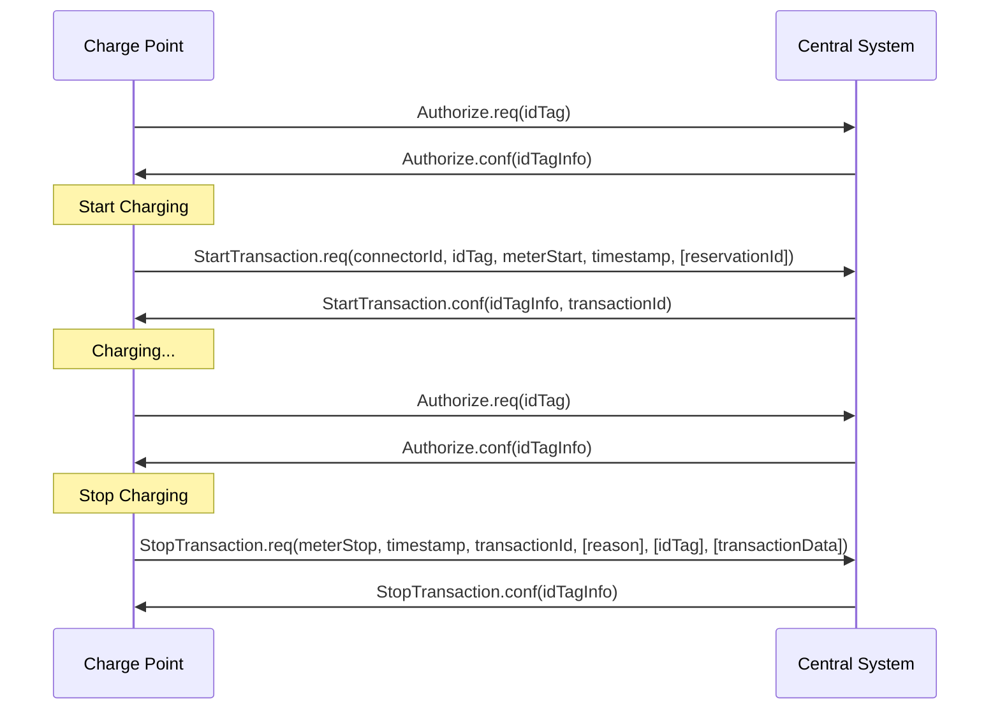

**그림 1. 시퀀스 다이어그램: 트랜잭션 시작 및 종료 예제**

충전기가 전기차를 충전해야 할 때, 충전을 시작하기 전에 먼저 사용자를 인증해야 한다. 사용자가 인증되면 충전기는 중앙 시스템에 충전을 시작했음을 알린다.

사용자가 충전기에서 전기차를 분리하고자 할 때, 충전기는 사용자가 충전을 시작한 사람이거나 같은 그룹에 속하여 충전 종료가 허용되는지 확인해야 한다. 인증되면 충전기는 중앙 시스템에 충전이 중지되었음을 알린다.

> **정보** | 제시된 idTag가 트랜잭션을 시작하기 위해 제시된 idTag와 동일한 경우, 충전기는 트랜잭션을 중지하기 전에 Authorize.req를 보내서는 안 된다(MUST NOT).

---

### Figure 2. Sequence Diagram: Example of a firmware update

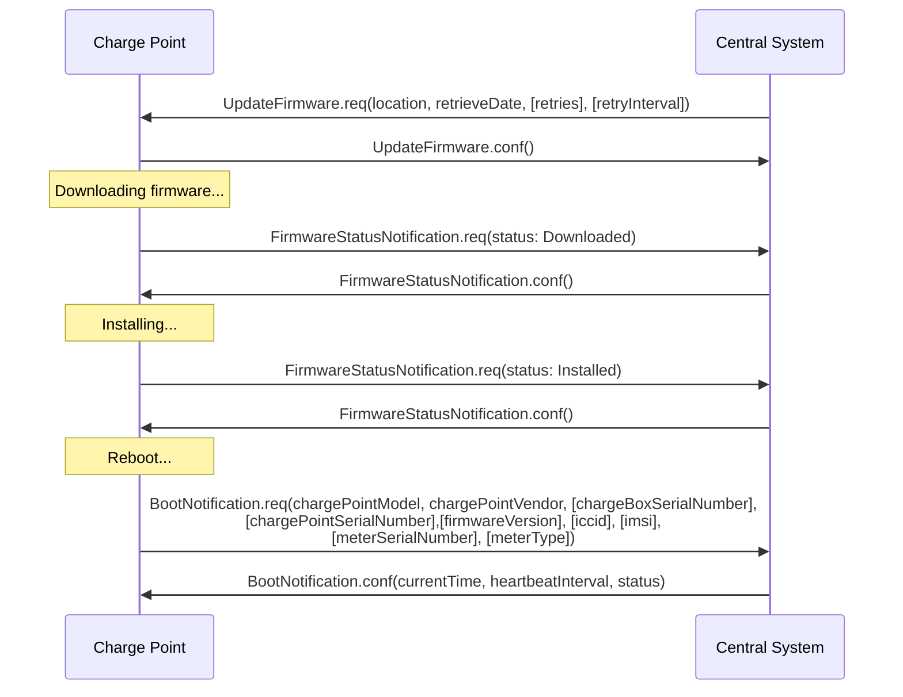

**그림 2. 시퀀스 다이어그램: 펌웨어 업데이트 예제**

충전기에 새 펌웨어로 업데이트해야 할 때, 중앙 시스템은 충전기에게 새 펌웨어 다운로드를 시작할 수 있는 시간을 알린다. 충전기는 새 펌웨어를 다운로드하고 설치하는 각 단계 후에 중앙 시스템에 알려야 한다(SHALL).

## 3.5. Local Authorization & Offline Behavior (로컬 인증 및 오프라인 동작)

**이 섹션은 규범적이다.**

통신이나 심지어 중앙 시스템을 사용할 수 없는 경우, 충전기는 독립적으로 작동하도록 설계되었다. 이러한 상황에서 충전기는 오프라인 상태라고 한다.

사용자 경험을 개선하기 위해 충전기는 Authorization Cache 및/또는 Local Authorization List를 사용하여 식별자의 로컬 인증을 지원할 수 있다(MAY).

이를 통해 (a) 오프라인일 때 사용자 인증 및 (b) 충전기와 중앙 시스템 간의 통신이 느릴 때 더 빠른 (겉보기) 인증 응답 시간이 가능하다.

**LocalAuthorizeOffline** 구성 키는 충전기가 오프라인일 때 Authorization Cache 및/또는 Local Authorization List를 사용하여 사용자를 인증할지 여부를 제어한다.

**LocalPreAuthorize** 구성 키는 충전기가 중앙 시스템의 인증 응답을 기다리지 않고 Authorization Cache 및/또는 Local Authorization List를 사용하여 트랜잭션을 시작할지 여부를 제어한다.

충전기는 오프라인일 때 제시된 모든 식별자의 (자동) 인증을 지원하여, Local Authorization List/Authorization Cache 항목으로 명시적으로 인증할 수 없는 정당한 사용자의 충전 거부를 방지할 수 있다(MAY). 이 기능은 Unknown Offline Authorization에서 더 자세히 설명된다.

### 3.5.1. Authorization Cache (인증 캐시)

충전기는 중앙 시스템에 의해 성공적으로 인증된 이전에 제시된 식별자의 기록을 자율적으로 유지하는 Authorization Cache를 구현할 수 있다(MAY). (성공적으로란 의미: idTag를 포함하는 메시지에 대해 응답을 받음)

구현되는 경우, Authorization Cache는 다음 의미론을 준수해야 한다(SHOULD):
- Cache는 가장 최근에 받은 모든 식별자(즉, 유효 및 유효하지 않은)를 포함한다.
- Cache는 수신된 모든 IdTagInfo(Authorize.conf, StartTransaction.conf 및 StopTransaction.conf에서)를 사용하여 업데이트된다.
- Cache 항목의 유효성이 만료되면, Cache에서 만료됨으로 변경되어야 한다(SHALL).
- Cache에 있는 식별자에 대해 IdTagInfo가 수신되면, 업데이트되어야 한다(SHALL).
- 새 식별자 인증 데이터가 수신되고 Authorization Cache가 가득 찬 경우, 충전기는 유효하지 않은 항목을 제거해야 하며(SHALL), 그런 다음 필요한 경우 가장 오래된 유효한 항목을 제거하여 새 항목을 위한 공간을 만들어야 한다.
- Cache 값은 비휘발성 메모리에 저장되어야 하며(SHOULD), 재부팅 및 정전에도 유지되어야 한다(SHOULD).
- 유효하지 않은 것으로 캐시에 저장된 식별자가 제시되고 충전기가 온라인 상태인 경우: 식별자의 현재 상태를 확인하기 위해 중앙 시스템에 Authorize.req를 보내야 한다(SHOULD).

Authorization Cache의 작동은 존재하는 경우 **AuthorizationCacheEnabled** 구성 키에 의해 보고되며(가능한 경우 제어됨).

### 3.5.2. Local Authorization List (로컬 인증 목록)

Local Authorization List는 중앙 시스템과 동기화할 수 있는 식별자 목록이다.

이 목록에는 모든(또는 선택된) 식별자의 인증 상태와 인증 상태/만료 날짜가 포함된다.

Local Authorization List의 식별자는 IdTagInfo 상태 값 Accepted/ConcurrentTx, Expired, Blocked 및 Invalid에 각각 해당하는 유효, 만료, (일시적으로) 차단 또는 블랙리스트로 표시될 수 있다.

이러한 값은 로컬 인증 중에 사용자에게 더 세밀한 정보를 제공하는 데 사용될 수 있다(예: 디스플레이 메시지).

Local Authorization List는 충전기에 의해 비휘발성 메모리에 유지되어야 하며(SHOULD), 재부팅 및 정전에도 유지되어야 한다(SHOULD).

Local Authorization List를 지원하는 충전기는 다음 구성 키를 구현해야 한다(SHOULD):
- **LocalAuthListMaxLength** 이것은 중앙 시스템이 충전기의 Local Authorization List 요소의 최대 가능 개수를 알 수 있는 방법을 제공한다.

충전기는 **SupportedFeatureProfiles** 구성 키 값에 LocalAuthListManagement 요소의 존재 여부로 Local Authorization List가 지원되는지 여부를 나타낸다.

Local Authorization List가 활성화되어 있는지 여부는 **LocalAuthListEnabled** 구성 키에 의해 보고되고 제어된다.

중앙 시스템은 (1) Local Authorization List를 교체하기 위해 전체 식별자 목록을 보내거나 (2) Local Authorization List에 적용할 변경 사항 목록(추가, 업데이트, 삭제)을 보내서 이 목록을 동기화할 수 있다. 이를 지원하는 작업은 Get Local List Version 및 Send Local List이다.

---

### Figure 3. Sequence Diagram: Example of a full local authorization list update

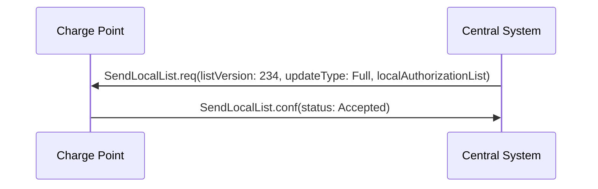

**그림 3. 시퀀스 다이어그램: 전체 로컬 인증 목록 업데이트 예제**

---

### Figure 4. Sequence Diagram: Example of a differential local authorization list update

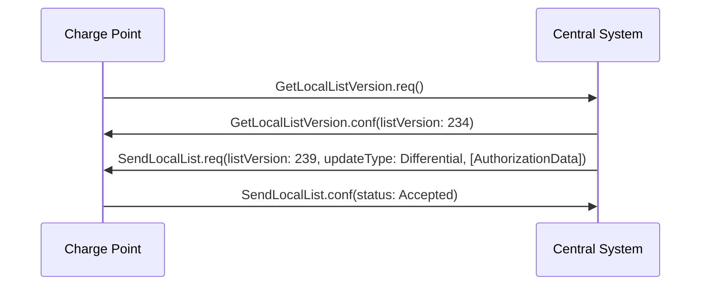

**그림 4. 시퀀스 다이어그램: 차등 로컬 인증 목록 업데이트 예제**

---

충전기는 중앙 시스템으로부터 SendLocalList PDU를 수신한 경우를 제외하고는 다른 어떤 수단으로도 Authorization List의 내용을 수정해서는 안 된다(SHALL NOT).

> **정보** | 로컬 인증 목록과 예를 들어 StartTransaction.conf 메시지에서 보고된 유효성 간에 충돌이 발생할 수 있다. 이런 경우 충전기는 ConnectorId를 0으로 설정하고 ErrorCode를 'LocalListConflict'로 설정하여 StatusNotification을 보내 중앙 시스템에 알려야 한다(SHALL).

### 3.5.3. Relation between Authorization Cache and Local Authorization List (인증 캐시와 로컬 인증 목록 간의 관계)

Authorization Cache와 Local Authorization List는 별개의 논리적 데이터 구조이다. Local Authorization List에 알려진 식별자는 Authorization Cache에 추가되어서는 안 된다(SHALL NOT).

Authorization Cache와 Local Authorization List가 모두 지원되는 경우, 충전기는 동일한 식별자에 대해 Local Authorization List 항목이 Authorization Cache 항목보다 우선순위를 가지는 것으로 처리해야 한다(SHALL).

### 3.5.4. Unknown Offline Authorization (알 수 없는 오프라인 인증)

오프라인일 때, 충전기는 Local Authorization List 또는 Authorization Cache 항목으로 명시적으로 인증할 수 없는 "알 수 없는" 식별자의 자동 인증을 허용할 수 있다(MAY). "Accepted" 이외의 상태(Invalid, Blocked, Expired)를 가진 Local Authorization List에 있는 식별자는 거부되어야 한다(MUST). 유효했지만 시간 경과로 인해 명백히 만료된 식별자도 거부되어야 한다(MUST).

Unknown Offline Authorization 기능의 작동은 지원되는 경우 **AllowOfflineTxForUnknownId** 구성 키에 의해 보고되며(가능한 경우 제어됨).

중앙 서버에 대한 연결이 복원되면, 충전기는 트랜잭션 관련 메시지 처리에서 요구하는 대로 오프라인에서 인증된 모든 트랜잭션에 대해 Start Transaction 요청을 보내야 한다(SHALL). StartTransaction.conf의 인증 상태가 Accepted가 아니고 트랜잭션이 여전히 진행 중인 경우, 충전기는 다음을 수행해야 한다(SHOULD):

- **StopTransactionOnInvalidId가 true로 설정된 경우:** Stop Transaction에 명시된 대로 정상적으로 트랜잭션을 중지한다. Stop Transaction 요청의 Reason 필드는 DeAuthorized로 설정되어야 한다. 충전기가 충전 케이블을 잠글 수 있는 경우, 소유자가 자신의 식별자를 제시할 때까지 충전 케이블을 잠금 상태로 유지해야 한다(SHOULD).

- **StopTransactionOnInvalidId가 false로 설정된 경우:** 차량에 대한 에너지 전달만 중지한다.

> **정보** | 유효하지 않은 식별자의 경우, 운영자는 EV가 떠날 수 있도록 최소한의 에너지로 EV를 충전하도록 선택할 수 있다(MAY). 이 양은 선택적 구성 키인 **MaxEnergyOnInvalidId**로 제어된다.

## 3.6. Transaction in relation to Energy Transfer Period (에너지 전송 기간과 관련된 트랜잭션)

**이 섹션은 정보 제공용이다.**

Energy Transfer Period는 EV와 EVSE 간에 에너지가 전송되는 기간이다.

트랜잭션 중에 여러 개의 Energy Transfer Period가 있을 수 있다(MAY).

여러 Energy Transfer Period는 다음 중 하나로 구분될 수 있다:
- EVSE가 시작한 전송 중단: EVSE가 에너지 전송을 제공하지 않는 동안
- EV가 시작한 전송 중단: EV가 EVSE에 전기적으로 연결된 상태를 유지하는 동안
- EV가 시작한 전송 중단: EV가 EVSE에 전기적으로 연결되지 않은 동안

중앙 시스템은 다음으로부터 Energy Transfer Period의 시작과 종료를 추론할 수 있다(MAY): 트랜잭션 중에 전송되는 MeterValues, 상태 알림: Charging, SuspendedEV 및/또는 SuspendedEVSE 등.

중앙 시스템 구현은 다음과 같은 요소를 고려해야 한다: 일부 EV는 SuspendedEV 상태로 전환되지 않고 계속해서 미세 충전을 할 수 있다. 일부 충전기는 전기 미터조차 없다.

---

### Figure 5. OCPP Charging Session and transaction definition

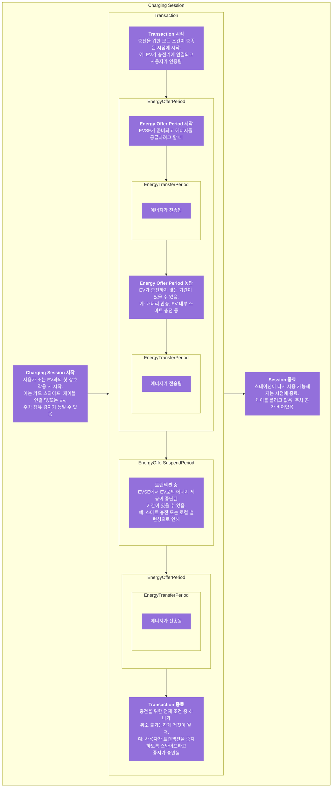

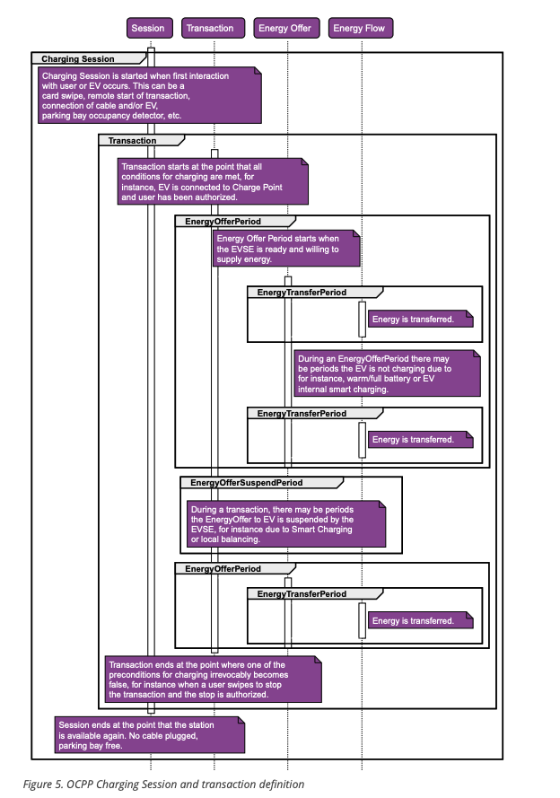

**그림 5. OCPP 충전 세션 및 트랜잭션 정의**

## 3.7. Transaction-related messages (트랜잭션 관련 메시지)

**이 섹션은 규범적이다.**

충전기는 트랜잭션 관련 메시지를 가능한 한 빨리 시간순으로 중앙 시스템에 전달해야 한다(SHOULD). 트랜잭션 관련 메시지는 StartTransaction.req, StopTransaction.req 및 주기적 또는 시간 정렬된 MeterValues.req 메시지이다.

오프라인일 때, 충전기는 온라인 상태였다면 중앙 시스템에 보냈을 모든 트랜잭션 관련 메시지를 큐에 저장해야 한다(MUST).

충전기에 중앙 시스템으로 전송하기 위해 대기 중인 트랜잭션 관련 메시지가 있는 경우, 트랜잭션과 관련되지 않은 새 메시지는 큐가 비워질 때까지 기다리지 않고 즉시 전달될 수 있다(MAY). 따라서 예를 들어 트랜잭션 관련 메시지 큐가 비워지기 전에 Authorize 요청이나 Notifications 요청을 보낼 수 있으므로 고객이 기다리지 않고 긴급 알림이 지연되지 않는다.

새로운 트랜잭션 관련 메시지의 전달은 큐가 비워질 때까지 기다려야 한다(SHALL). 이는 트랜잭션 관련 메시지가 항상 시간순으로 전달되도록 보장하기 위함이다.

중앙 시스템이 충전기에서 한동안 대기 중이었던 트랜잭션 관련 메시지를 수신할 때, 중앙 시스템은 이것이 과거 메시지라는 것을 인지하지 못할 것이며, 다양한 타임스탬프가 상당히 과거라는 추론을 통해서만 알 수 있다. 중앙 시스템은 이러한 메시지를 다른 메시지와 동일하게 처리해야 한다(SHOULD).

### 3.7.1. Error responses to transaction-related messages (트랜잭션 관련 메시지에 대한 오류 응답)

충전기가 트랜잭션 관련 메시지를 건너뛰는 것은 중앙 시스템이 반복적으로 '메시지 처리 실패'를 보고하는 경우에만 허용된다. 이러한 규정이 필요한 이유는, 그렇지 않으면 모든 트랜잭션 관련 메시지를 시간순으로 전달해야 한다는 요구 사항으로 인해 소프트웨어 버그로 중앙 시스템이 충전기의 트랜잭션 관련 메시지 중 하나를 승인하지 않을 경우 충전기가 중앙 시스템에 트랜잭션 관련 메시지를 전달할 수 없게 되기 때문이다.

어떤 종류의 응답 또는 응답 실패가 '메시지 처리 실패'를 구성하는지는 OCPP JSON Specification 및 OCPP SOAP Specification 문서에 정의되어 있다.

충전기가 이러한 실패한 트랜잭션 관련 메시지를 재시도해야 하는 횟수와 간격은 **TransactionMessageAttempts** 및 **TransactionMessageRetryInterval** 구성 키를 사용하여 구성될 수 있다(MAY).

충전기가 특정 트랜잭션 관련 메시지를 전달하는 데 처음 실패하면, 메시지 처리 실패가 계속 발생하고 **TransactionMessageAttempts** 구성 키에 지정된 만큼의 메시지 처리 실패를 아직 경험하지 않은 한 이 메시지를 다시 보내야 한다(SHOULD). 재전송할 때마다 **TransactionMessageRetryInterval** 키에 지정된 초만큼 대기해야 하며(SHOULD), 이는 동일한 메시지의 이전 전송 횟수를 곱한 값이다.

예를 들어, **TransactionMessageAttempts** 구성 키 값이 "3"이고 **TransactionMessageRetryInterval** 구성 키 값이 "60"인 충전기를 고려해보자. StopTransaction 메시지를 보내고 중앙 시스템에서 메시지 처리 실패를 감지한다. 충전기는 60초를 기다린 후 메시지를 재전송해야 한다(SHALL). 두 번째 실패가 발생한 경우, 충전기는 메시지를 재전송하기 전에 120초를 기다려야 한다(SHALL). 이 최종 시도가 실패하면, 충전기는 메시지를 폐기하고 다음 트랜잭션 관련 메시지가 있으면 계속 진행해야 한다(SHOULD).

## 3.8. Connector numbering (커넥터 번호 매기기)

**이 섹션은 규범적이다.**

중앙 시스템이 충전기의 모든 커넥터를 지정할 수 있도록 하려면, ConnectorId는 항상 동일한 방식으로 번호가 매겨져야 한다(MUST).

커넥터 번호 매기기(ConnectorIds)는 다음과 같아야 한다(MUST):
- 첫 번째 커넥터의 ID는 1이어야 한다(MUST)
- 추가 커넥터는 순차적으로 번호가 매겨져야 한다(MUST) (번호를 건너뛸 수 없음)
- ConnectorId는 충전기의 총 커넥터 수보다 높아서는 안 된다(MUST)
- 중앙 시스템이 시작한 작업의 경우, ConnectorId 0은 전체 충전기를 지정하기 위해 예약되어 있다.
- 충전기가 시작한 작업의 경우(보고 시), ConnectorId 0은 충전기 메인 컨트롤러를 위해 예약되어 있다.

예: 3개의 커넥터가 있는 충전기: 모든 커넥터는 ID 1, 2, 3으로 번호가 매겨져야 한다(MUST). 충전기의 커넥터를 논리적인 방식으로 번호를 매기는 것이 좋다: 왼쪽에서 오른쪽으로, 위에서 아래로 증가.

## 3.9. ID Tokens (ID 토큰)

**이 섹션은 규범적이다.**

대부분의 경우, 로컬 토큰 리더 하드웨어를 통해 획득한 IdToken 데이터는 일반적으로 물리적 RFID 카드의 (4 또는 7바이트) UID 값이며, 일반적으로 8/14 16진수 자리 문자로 표시된다.

그러나, 원격으로 시작된 충전 세션을 위해 중앙 시스템이 충전기로 보내는 IdToken은 일반적으로 (일회용) 가상 트랜잭션 인증 코드이거나, 실제 UID 값과의 충돌을 의도적으로 피하기 위해 비표준 UID 형식을 사용하는 가상 RFID 토큰일 수 있다.

또한, ParentId로 사용되는 IdToken 데이터는 계정의 첫 번째/마스터 RFID 카드의 UID 대신 ParentId에 공유 중앙 계정 식별자를 사용하는 경우가 많다.

따라서, IdToken 클래스의 메시지 데이터 요소(ParentId 포함)는 데이터 타입(CiString20Type)의 제약 조건에 따라 중앙 시스템에 의미가 있는 모든 데이터를 포함할 수 있으며(MAY) (예: 충전 활동 개시자를 식별하기 위한 목적), 충전기는 이러한 데이터의 형식이나 내용에 대해 어떠한 가정도 해서는 안 된다(MUST NOT) (예: 16진수 문자만 있어야 하고/또는 짝수 자릿수여야 하는 UID와 유사한 값이라고 가정).

> **정보** | 상호 운용성을 촉진하기 위해, 물리적 ISO 14443 호환 RFID 카드 UID를 나타내는 IdToken 데이터의 경우 현재까지의 일반적인 관행에 기반하여, 이러한 UID는 UID 바이트의 16진수 표현으로 나타내는 것이 권장된다(RECOMMENDED). ISO14443-3에 따르면, 바이트 0이 16진수 문자열에서 먼저 와야 한다.

## 3.10. Parent idTag (부모 idTag)

**이 섹션은 규범적이다.**

중앙 시스템은 식별 토큰 세트를 "그룹"으로 처리할 수 있는 기능이 있으며, 이를 통해 그룹의 한 토큰이 트랜잭션을 시작하고 동일한 토큰 또는 동일한 그룹의 다른 토큰이 트랜잭션을 중지할 수 있다. 이는 단일 재충전 계약 계정으로 하나 이상의 공유 전기차를 사용하는 여러 운전자가 있는 가족이나 기업의 일반적인 사용 사례를 지원한다.

토큰(idTag)은 IdTagInfo의 선택적 ParentId 요소에 공통 그룹 식별자를 지정하여 인증 목적으로 그룹화된다: 두 idTag의 ParentId Tag가 일치하면 동일한 그룹에 있는 것으로 간주된다.

> **정보** | ParentId는 idTag와 동일한 명목상 데이터 타입(IdToken)을 가지지만, 이 요소의 값은 IdToken의 일반적인 형식이 아닐 수 있고/또는 실제 유효한 IdToken을 나타내지 않을 수 있다(예: 공통 공유 "계정 번호"일 수 있음): 따라서 ParentId 값은 제시된 토큰 값과의 비교에 사용되어서는 안 된다(SHOULD NOT) (idTag 값으로도 발생하지 않는 한).

## 3.11. Reservations (예약)

**이 섹션은 정보 제공용이다.**

Reserve Now 작업을 사용하여 충전기를 예약할 수 있다. 이 작업은 특정 idTag에 대해 특정 만료 시간까지 충전기를 예약한다. '그룹' 예약을 지원하기 위해 부모 idTag가 예약에 포함될 수 있다. 충전기의 특정 커넥터를 예약하거나 충전기의 모든 커넥터를 예약할 수 있다. 예약은 예약된 idTag가 예약된 커넥터(지정된 경우) 또는 모든 커넥터(지정되지 않은 경우)에서 사용되거나 만료 시간에 도달하거나 예약이 명시적으로 취소될 때 해제된다.

## 3.12. Vendor-specific data transfer (벤더별 데이터 전송)

**이 섹션은 정보 제공용이다.**

벤더별 데이터 전송 메커니즘은 OCPP에서 표준화되지 않은 데이터나 메시지의 교환을 허용한다. 따라서 향후 OCPP 버전에 포함될 수 있는 실험적 기능을 위한 OCPP 내 프레임워크를 제공한다. 새로운 (호환되지 않을 수 있는) OCPP 방언을 만들지 않고도 실험할 수 있다. 둘째, 특정 중앙 시스템과 충전기 벤더 간에 합의된 추가 기능을 구현할 가능성을 제공한다.

Vendor Specific Data 작업은 중앙 시스템 또는 충전기에 의해 시작될 수 있다(MAY).

> **주의!** | 이 옵션을 사용하지 않는 다른 시스템과의 호환성에 영향을 미치므로 선택적 기능에만 극도로 주의하여 사용하십시오. 문서 및/또는 커뮤니케이션에 사용을 명시적으로 언급하는 것이 좋습니다. 기능을 추가하기 위해 이 옵션을 사용하기 전에 Open Charge Alliance와 상담하는 것을 고려하십시오.

## 3.13. Smart Charging (스마트 충전)

**이 섹션은 규범적이다.**

스마트 충전을 통해 중앙 시스템은 특정 EV의 충전 전력이나 전류, 또는 전체 충전기/충전기 그룹의 총 허용 에너지 소비에 영향을 줄 수 있는 능력을 얻는다. 예를 들어, 그리드 연결, 그리드의 에너지 가용성 또는 건물의 배선을 기반으로 할 수 있다. 충전 전력이나 전류에 영향을 주는 것은 특정 시점의 에너지 전송 제한을 기반으로 한다. 이러한 제한은 Charging Profile에 결합된다.

충전 프로파일은 충전 스케줄로 구성되며, 이는 기본적으로 최대 충전 전력이나 전류가 있는 시간 간격 목록과 스케줄의 기간 및 반복을 지정하는 일부 값으로 구성된다.

충전 프로파일에는 목적에 따라 세 가지 다른 유형이 있다:

### ChargePointMaxProfile

부하 분산 시나리오에서 충전기는 충전기의 모든 커넥터가 공유할 전력이나 전류를 제한하는 하나 이상의 로컬 충전 프로파일을 가진다. 중앙 시스템은 ChargingProfilePurpose를 "ChargePointMaxProfile"로 설정하여 이러한 프로파일을 구성해야 한다(SHALL). ChargePointMaxProfile은 충전기 ConnectorId 0에서만 설정할 수 있다.

### TxDefaultProfile

새 트랜잭션에 대한 기본 스케줄은 충전 정책을 부과하는 데 사용될 수 있다(MAY). 예를 들어 낮 동안 충전을 방지하는 정책이 있을 수 있다. 이러한 목적의 스케줄의 경우, ChargingProfilePurpose를 TxDefaultProfile로 설정해야 한다(SHALL).

TxDefaultProfile이 ConnectorId 0으로 설정되면, TxDefaultProfile은 모든 커넥터에 적용된다.

ConnectorId가 >0으로 설정되면, 해당 특정 커넥터에만 적용된다.

커넥터 0에 대한 TxDefaultProfile이 설치되어 있고 중앙 시스템이 ConnectorId >0인 새 프로파일을 보내는 경우, TxDefaultProfile은 해당 특정 커넥터에 대해서만 교체되어야 한다(SHALL).

### TxProfile

목적이 TxProfile인 트랜잭션별 프로파일이 있는 경우, 현재 트랜잭션 기간 동안만 목적이 TxDefaultProfile인 기본 충전 프로파일을 대체해야 한다(SHALL). 트랜잭션이 중지된 후, 프로파일은 삭제되어야 한다(SHOULD). TxProfile 유형의 충전 프로파일에 지정된 커넥터에 활성 트랜잭션이 없으면, 충전기는 이를 폐기하고 SetChargingProfile.conf에서 오류 상태를 반환해야 한다(SHALL).

트랜잭션에 적용되는 최종 스케줄 제약 조건은 목적이 ChargePointMaxProfile인 프로파일을 TxProfile 프로파일 또는 목적이 TxProfile인 프로파일이 제공되지 않은 경우 TxDefaultProfile과 병합하여 결정된다. TxProfile은 충전기 ConnectorId >0에서만 설정되어야 한다(SHALL).

### 3.13.2. Stacking charging profiles (충전 프로파일 스태킹)

복잡한 일정을 설명하기 위해 동일한 충전 프로파일 목적의 충전 프로파일을 스택하는 것이 허용된다. 예를 들어, 평일 23:00h부터 06:00h까지와 주말 00:00h부터 24:00h까지 최대 전력 또는 전류 충전을 허용하고 다른 시간에는 감소된 전력 또는 전류 충전을 허용하는 1주일의 기간과 반복을 가진 목적이 TxDefaultProfile인 충전 프로파일을 정의할 수 있다. 그 위에 이 규칙에 대한 예외를 정의하는 다른 TxDefaultProfile을 정의할 수 있다. 예를 들어 휴일에 대한 예외.

충전 프로파일의 우선순위는 StackLevel 매개변수의 값에 의해 결정된다. 모든 시점에서 우세한 충전 프로파일은 validFrom 및 validTo 매개변수에 의해 결정된 해당 시점에서 유효한 프로파일 중 가장 높은 stackLevel을 가진 충전 프로파일이어야 한다(SHALL).

충돌을 피하기 위해, 충전기에 동일한 stackLevel과 Purpose를 가진 여러 충전 프로파일의 존재는 허용되지 않는다. 충전기가 충전기에 이미 존재하는 stackLevel과 Purpose를 가진 충전 프로파일을 받을 때마다, 충전기는 기존 프로파일을 교체해야 한다(SHALL).

> **정보** | 업데이트된 충전 프로파일(동일한 stackLevel과 purpose)이 미래의 validFrom dateTime으로 전송되는 경우, 충전기는 설치된 프로파일을 교체해야 하며(SHALL) validFrom에 도달할 때까지 기본 동작으로 되돌아가야 한다(SHALL). 간격을 방지하기 위해 과거의 시작 시간을 제공하는 것이 권장된다(RECOMMENDED).

> **정보** | 가장 높은 스택 레벨에서 기간 없이 스태킹을 사용하는 경우, 충전기는 더 낮은 스택 레벨 프로파일로 되돌아가지 않을 것이다.

### 3.13.3. Combining charging profile purposes (충전 프로파일 목적 결합)

충전 레벨을 안내하는 Composite Schedule은 서로 다른 chargingProfilePurpose의 우세한 충전 프로파일의 조합이다.

이 Composite Schedule은 각 시간 간격에 대해 최소값을 취하여 계산된다. 시간 간격은 고정된 길이일 필요가 없으며, 모든 충전 프로파일 목적에 대해 동일할 필요도 없다는 점에 유의한다. 이는 결과 Composite Schedule이 다른 길이의 간격을 포함할 수 있음(MAY)을 의미한다.

모든 시점에서 충전 프로파일 ChargePointMaxProfile과 TxDefaultProfile(또는 TxProfile)의 스케줄을 병합한 결과인 Composite Schedule의 사용 가능한 전력 또는 전류는 병합된 스케줄의 사용 가능한 전력 또는 전류의 최소값보다 작거나 같아야 한다(SHALL).

충전기에 둘 이상의 커넥터가 장착된 경우, ChargePointMaxProfile의 제한값은 모든 커넥터를 합친 제한값이다. 모든 커넥터의 결합된 에너지 흐름은 ChargePointMaxProfile에서 설정한 제한보다 커서는 안 된다(SHALL NOT).

### 3.13.4. Smart Charging Use Cases (스마트 충전 사용 사례)

**이 섹션은 정보 제공용이다.**

스마트 충전에는 다양한 용도가 있을 수 있다. 다음 세 가지 전형적인 종류의 스마트 충전은 스마트 충전의 가능한 동작을 설명하는 데 사용될 것이다:
- 부하 분산 (Load balancing)
- 중앙 스마트 충전 (Central smart charging)
- 로컬 스마트 충전 (Local smart charging)

위의 사용 사례 중 두 가지 이상을 하나의 더 복잡한 시스템으로 결합한 더 복잡한 사용 사례가 가능하다.

#### Load Balancing (부하 분산)

**이 섹션은 정보 제공용이다.**

부하 분산 사용 사례는 충전기 내부의 내부 부하 분산에 관한 것이며, 충전기는 커넥터별 충전 스케줄을 제어한다. 충전기는 고정 제한으로 구성된다. 예를 들어 그리드에 대한 연결의 최대 전류.

선택적 충전 스케줄 필드 **minChargingRate**는 충전기가 커넥터 간의 전력 분배를 최적화하는 데 사용될 수 있다(MAY). 이 매개변수는 minChargingRate 미만의 충전이 비효율적임을 충전기에 알려서 다른 분산 전략을 선택할 가능성을 제공한다.

#### Central Smart Charging (중앙 스마트 충전)

**이 섹션은 정보 제공용이다.**

중앙 스마트 충전을 사용하면 트랜잭션당 충전 스케줄에 대한 제약 조건이 중앙 시스템에 의해 결정된다. 중앙 시스템은 이러한 스케줄을 사용하여 외부 시스템에서 부과하는 제한 내에 머물 수 있다. 중앙 시스템은 충전기의 커넥터에 대한 제한을 직접 제어한다.

중앙 스마트 충전은 충전 제한이 중앙 시스템에 의해 제어된다고 가정한다. 중앙 시스템은 그리드 운영자(DSO) 또는 다른 소스로부터 어떤 형태로든 용량 예측을 받고 일부 또는 모든 충전 트랜잭션에 대한 충전 스케줄을 계산하는데, 그 세부 사항은 이 명세의 범위를 벗어난다.

중앙 시스템은 커넥터에 충전 제한을 부과한다. StartTransaction.req PDU에 대한 응답으로 중앙 시스템은 TxProfile을 사용하여 트랜잭션에 충전 제한을 설정하도록 선택할 수 있다.

중앙 스마트 충전은 Control Pilot 신호로 수행될 수 있지만, EV가 Control Pilot 신호를 통해 충전을 전달할 수 없기 때문에 몇 가지 제한이 있다. 로컬 스마트 충전 사용 사례와 유사하게, 커넥터는 Control Pilot 신호로 충전 스케줄을 실행할 수 있다. 이는 아래 그림에 나와 있다:

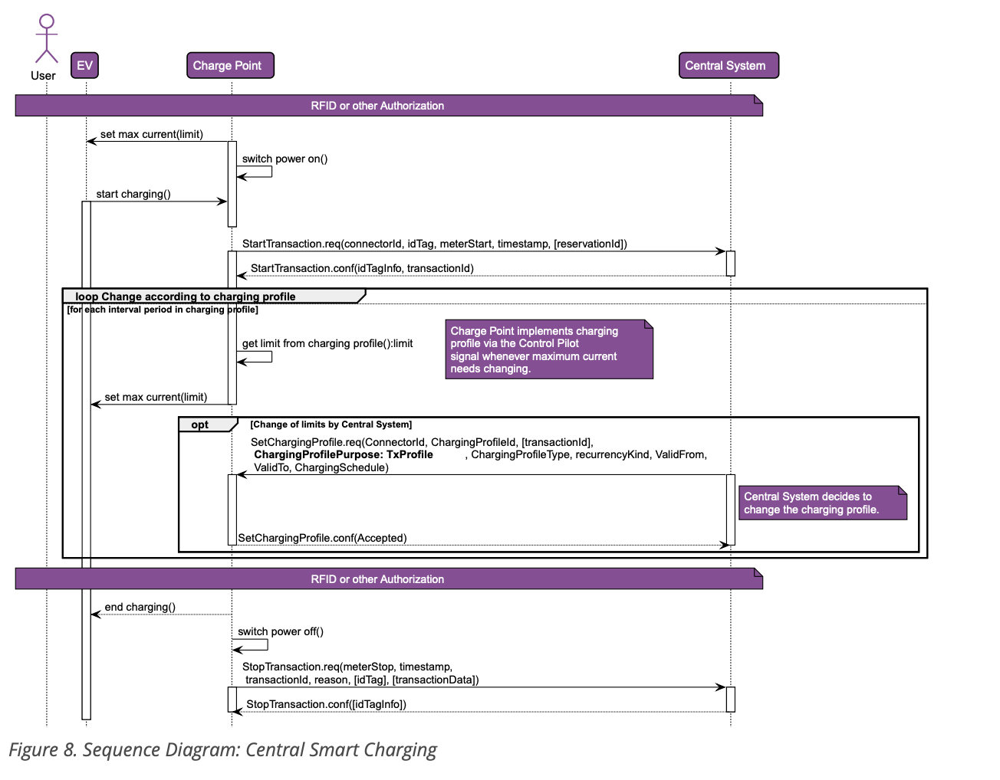

위 그림에 대한 설명:

- 인증 후 커넥터는 Control Pilot 신호를 통해 사용할 최대 전류를 설정한다. 이 제한은 커넥터가 이전에 중앙 시스템으로부터 받은 (기본) 충전 프로파일을 기반으로 한다. EV가 충전을 시작하고 StartTransaction.req가 중앙 시스템으로 전송된다.
- 충전이 진행되는 동안 커넥터는 충전 프로파일에 따라 최대 전류 또는 전력을 지속적으로 조정한다. 선택적으로, 중앙 시스템은 언제든지 EV의 제한 스케줄로 사용되어야 하는 커넥터에 대한 새 충전 프로파일을 보낼 수 있다.

#### Local Smart Charging (로컬 스마트 충전)

**이 섹션은 정보 제공용이다.**

로컬 스마트 충전 사용 사례는 스마트 충전이 활성화된 충전기가 중앙 시스템이 아닌 로컬 컨트롤러에 의해 로컬로 제어되는 충전 제한을 가진 사용 사례를 설명한다. 로컬 스마트 충전의 사용 사례는 충전기 그룹이 사용할 수 있는 전력량을 특정 최대값으로 제한하는 것에 관한 것이다. 일반적인 사용은 그리드에 대한 연결 등급이 충전기 등급의 합보다 적은 주차장의 여러 충전기일 것이다. 또 다른 응용 프로그램은 로컬 컨트롤러가 DSO 또는 로컬 스마트 그리드 노드로부터 전력 가용성에 대한 정보를 받는 것일 수 있다.

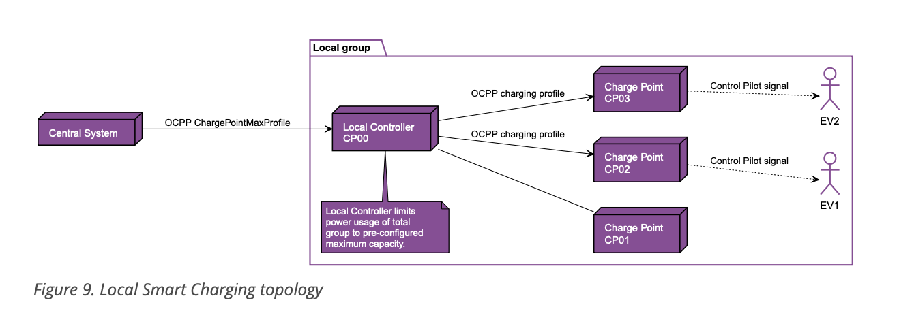

로컬 스마트 충전은 충전기 그룹을 제어하기 위한 로컬 컨트롤러의 존재를 가정한다. 로컬 컨트롤러는 논리적 구성 요소이다. 별도의 물리적 구성 요소로 구현되거나 여러 다른 충전기를 제어하는 '마스터' 충전기의 일부로 구현될 수 있다. 로컬 컨트롤은 OCPP 프로토콜을 구현하며 그룹 구성원의 OCPP 메시지에 대한 프록시이며, 자체 커넥터를 가질 수도 있고 가지지 않을 수도 있다.

로컬 스마트 충전의 경우, 로컬 컨트롤러는 충전기에 충전 제한을 부과한다. 이러한 제한은 충전기 그룹의 전력 소비를 그룹 제한 내에 유지하기 위해 충전 프로세스 중에 동적으로 변경될 수 있다. 그룹 제한은 로컬 컨트롤러에 사전 구성되거나 중앙 시스템에 의해 구성되었을 수 있다.

선택적 충전 스케줄 필드 **minChargingRate**는 로컬 컨트롤러가 커넥터 간의 전력 분배를 최적화하는 데 사용될 수 있다(MAY). 이 매개변수는 minChargingRate 미만의 충전이 비효율적임을 로컬 컨트롤러에 알려서 다른 분산 전략을 선택할 가능성을 제공한다.

다음 다이어그램은 로컬 스마트 충전 그룹의 충전기에 충전 제한을 설정하는 메시지 시퀀스를 보여준다. 이러한 제한은 로컬 컨트롤러에 어떤 방식으로든 사전 구성되거나 중앙 시스템에 의해 설정될 수 있다. 로컬 컨트롤러에는 필요에 따라 제한을 조정하여 연결된 커넥터 간에 이 용량을 분배하는 로직이 포함되어 있다.

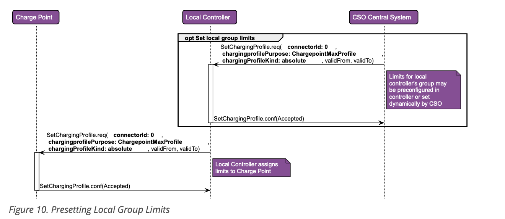

다음 다이어그램은 로컬 스마트 충전의 전형적인 경우에 대한 메시지 시퀀스를 설명한다. 단순화를 위해 이 경우는 하나의 커넥터만 포함한다.

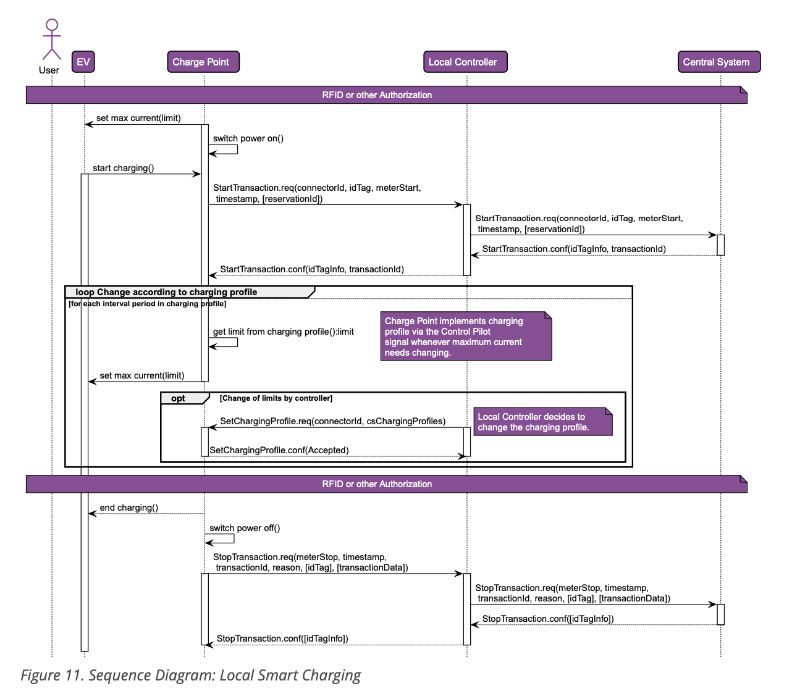

위 그림에 대한 설명:

- 인증 후 커넥터는 Control Pilot 신호를 통해 사용할 최대 전류를 설정한다. 이 제한은 커넥터가 이전에 로컬 컨트롤러로부터 받은 (기본) 충전 프로파일을 기반으로 한다. EV가 충전을 시작하고 StartTransaction.req를 전송한다.
- StartTransaction.req는 로컬 컨트롤러를 통해 중앙 시스템으로 전송되므로 로컬 컨트롤러도 트랜잭션이 시작되었음을 알 수 있다. 로컬 컨트롤러는 충전기와 중앙 시스템 간의 메시지를 그대로 전달하므로 중앙 시스템이 모든 로컬 스마트 충전 그룹 구성원을 개별적으로 지정할 수 있다.
- 충전이 진행되는 동안 커넥터는 충전 프로파일에 따라 최대 전류를 지속적으로 조정한다.

선택적으로, 로컬 컨트롤러는 언제든지 EV의 제한 스케줄로 사용되어야 하는 커넥터에 새 충전 프로파일을 보낼 수 있다.

### 3.13.5. Discovery of Charge Point Capabilities (충전기 기능 발견)

**이 섹션은 규범적이다.**

정의된 스마트 충전 옵션은 광범위한 방식으로 사용될 수 있다. 충전기 간의 가능한 제한 사항과 기능 차이로 인해, 중앙 시스템은 충전기별 기능을 발견할 수 있어야 한다. 이는 이 장에서 정의된 표준화된 구성 키로 보장된다. 스마트 충전이 활성화된 충전기는 GetConfiguration.req PDU를 통해 다음 구성 키를 구현하고 보고를 지원해야 한다(SHALL).

**스마트 충전 구성 키**

- **ChargeProfileMaxStackLevel** (충전 프로파일 최대 스택 레벨)
- **ChargingScheduleAllowedChargingRateUnit** (충전 스케줄 허용 충전 속도 단위)
- **ChargingScheduleMaxPeriods** (충전 스케줄 최대 기간)
- **MaxChargingProfilesInstalled** (설치된 최대 충전 프로파일)

모든 표준화된 구성 키의 전체 목록은 Standard Configuration Key Names & Values 장에서 찾을 수 있다.

### 3.13.6. Offline behavior of smart charging (스마트 충전의 오프라인 동작)

**이 섹션은 규범적이다.**

충전기가 목적이 TxProfile인 트랜잭션별 충전 프로파일을 수신한 후 오프라인 상태가 되면, 트랜잭션이 지속되는 동안 이 프로파일을 계속 사용해야 한다(SHALL).

충전기가 트랜잭션이 시작되기 전에 또는 목적이 TxProfile인 트랜잭션별 충전 프로파일을 수신하기 전에 오프라인 상태가 되면, 사용 가능한 충전 프로파일을 사용해야 한다(SHALL). 다음 충전 프로파일 목적 중 0개 이상이 이전에 중앙 시스템으로부터 수신되었을 수 있다(MAY):

- ChargePointMaxProfile
- TxDefaultProfile

서로 다른 목적을 가진 충전 프로파일을 결합하는 방법에 대한 설명은 Combining Charging Profile Purposes 섹션을 참조하라.

충전기가 충전 프로파일 없이 오프라인 상태가 되면, 제약 조건이 적용되지 않는 것처럼 트랜잭션을 실행해야 한다(SHALL).

### 3.13.7. Example data structure for smart charging (스마트 충전을 위한 데이터 구조 예시)

**이 섹션은 정보 제공용이다.**

다음 데이터 구조는 08:00시와 20:00시 사이에 전력을 6 kW로 제한하는 일일 기본 프로파일을 설명한다.

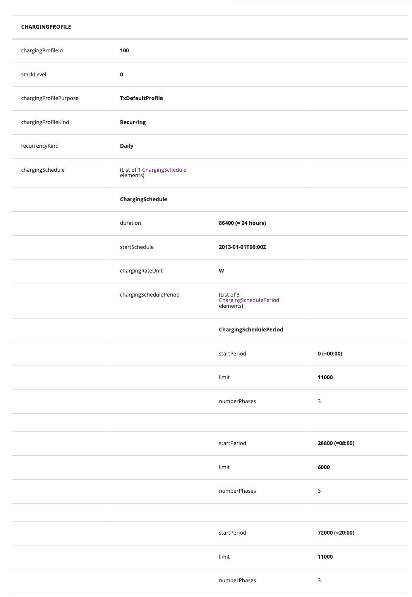

> **참고:** 충전 중 사용되는 상(phase)의 수는 충전기, EV 및 충전기와 EV 사이의 케이블의 기능에 의해 제한된다. 이 세 가지 중 하나라도 3상 충전을 지원하지 않으면 EV는 1상만 사용하여 충전된다.

> **참고:** 스케줄 또는 충전 세션 중에 사용 중인 상의 수를 전환하는 것은 주의해서 수행해야 한다. 일부 EV는 이를 지원하지 않을 수 있으며, 상의 수를 변경하면 물리적 손상이 발생할 수 있다. 구성 키 ConnectorSwitch3to1PhaseSupported를 사용하여 충전기는 트랜잭션 중에 상의 수 전환을 지원하는지 알릴 수 있다.

> **참고:** DST(일광 절약 시간)가 시작되거나 종료되는 날에는 특별한 프로파일이 필요할 수 있다(예: 상대 프로파일의 경우).

## 3.14. Time zones (시간대)

**이 섹션은 정보 제공용이다.**

OCPP는 시간 값에 특정 시간대의 사용을 규정하지 않는다. 그러나 중앙 시스템과 충전기 간의 상호 운용성을 향상시키기 위해 모든 시간 값에 UTC를 사용하는 것을 강력히 권장한다.

## 3.15. Time notations (시간 표기법)

**이 섹션은 규범적이다.**

구현은 ISO 8601 날짜 시간 표기법을 사용해야 한다(MUST). 메시지 수신자는 소수 초 및 시간대 오프셋을 처리할 수 있어야 한다(다른 구현에서 이를 사용할 수 있음). 메시지 발신자는 중요하지 않은 소수 초를 생략하여 데이터 사용량을 절약할 수 있다(MAY).

## 3.16. Metering Data (계량 데이터)

**이 섹션은 규범적이다.**

충전 세션과 관련된 광범위한 계량 데이터는 의도된 목적에 따라 다양한 방식으로 기록되고 전송될 수 있다. 두 가지 명백한 사용 사례가 있다(그러나 미터 값의 사용이 이 두 가지로 제한되는 것은 아니다):

- Charging Session Meter Values (충전 세션 미터 값)
- Clock-Aligned Meter Values (클럭 정렬 미터 값)

두 유형의 미터 판독값 모두 독립 실행형 MeterValues.req 메시지(트랜잭션 중)로 보고될 수 있으며(MAY), 그리고/또는 StopTransaction.req PDU의 transactionData 요소의 일부로 보고될 수 있다(MAY).

### 3.16.1. Charging Session Meter Values (충전 세션 미터 값)

빈번한(예: 1-5분 간격) 미터 판독값이 중앙 시스템으로 (일반적으로 "실시간"으로) 전송되어, 웹, 앱, SMS 등을 통해 충전 세션의 진행 상황에 대한 정보 업데이트를 (일반적으로 충전기에 있지 않은) EV 사용자에게 제공할 수 있도록 한다. OCPP에서 이를 "샘플링된 미터 데이터"라고 하며, 판독의 정확한 빈도와 시간은 "충분히 빈번한" 한 그다지 중요하지 않다. "샘플링된 미터 데이터"는 다음 구성 키로 구성할 수 있다:

- MeterValuesSampledData
- MeterValuesSampledDataMaxLength
- MeterValueSampleInterval
- StopTxnSampledData
- StopTxnSampledDataMaxLength

**MeterValueSampleInterval**은 "MeterValues" PDU로 전송하려는 계량(또는 기타) 데이터의 샘플링 간격(초)이다. 샘플은 충전 트랜잭션 시작부터 이 간격으로 주기적으로 획득되고 전송된다.

관례상 "0"(숫자 0) 값은 샘플링된 데이터를 전송하지 않아야 함을 의미하는 것으로 해석된다.

**MeterValuesSampledData**는 MeterValueSampleInterval 초마다 MeterValues.req PDU에 포함될 측정값 세트를 규정하는 쉼표로 구분된 목록이다. MeterValuesSampledData 목록의 최대 요소 수는 충전기가 다음을 통해 보고할 수 있다: **MeterValuesSampledDataMaxLength**

**StopTxnSampledData**는 트랜잭션 시작부터 MeterValueSampleInterval 초마다 StopTransaction.req PDU의 TransactionData 요소에 포함될 샘플링된 측정값을 규정하는 쉼표로 구분된 목록이다. StopTxnSampledData 목록의 최대 요소 수는 충전기가 다음을 통해 보고할 수 있다: **StopTxnSampledDataMaxLength**

### 3.16.2. Clock-Aligned Meter Values (클럭 정렬 미터 값)

그리드 운영자는 회계 인증된 에너지 미터에서 특정 클럭 정렬 시간(일반적으로 15분 또는 30분마다)에 미터 판독값을 가져오도록 요구할 수 있다.

"클럭 정렬 과금 데이터"는 다음 구성 키로 구성할 수 있다:

- ClockAlignedDataInterval
- MeterValuesAlignedData
- MeterValuesAlignedDataMaxLength
- StopTxnAlignedData
- StopTxnAlignedDataMaxLength

**ClockAlignedDataInterval**은 클럭 정렬 데이터 간격의 크기(초)이다. 이는 00:00:00(자정)부터 시작하여 하루당 균등하게 간격을 둔 미터 데이터 집계 간격 세트를 정의한다.

예를 들어, 900(15분) 값은 매일 96개의 15분 간격으로 나누어져야 함을 나타낸다.

관례상 "0"(숫자 0) 값은 클럭 정렬 데이터를 전송하지 않아야 함을 의미하는 것으로 해석된다.

**MeterValuesAlignedData**는 ClockAlignedDataInterval 초마다 MeterValues.req PDU에 포함될 측정값 세트를 규정하는 쉼표로 구분된 목록이다. MeterValuesAlignedData 목록의 최대 요소 수는 충전기가 다음을 통해 보고할 수 있다: **MeterValuesAlignedDataMaxLength**

**StopTxnAlignedData**는 트랜잭션의 모든 ClockAlignedDataInterval마다 StopTransaction.req PDU의 TransactionData 요소에 포함될 클럭 정렬 주기적 측정값 세트를 규정하는 쉼표로 구분된 목록이다. StopTxnAlignedData 목록의 최대 요소 수는 충전기가 다음을 통해 보고할 수 있다: **StopTxnAlignedDataMaxLength**

### 3.16.3. Multiple Locations/Phases (다중 위치/상)

충전기가 여러 위치 또는 상에서 동일한 측정값을 측정할 수 있는 경우, 관련 구성 키 중 하나에 구성될 때 가능한 모든 위치 및/또는 상이 보고되어야 한다(SHALL).

예를 들어: Inlet(모든 3상)(그리드 연결) 및 Outlet(두 커넥터 각각의 커넥터당 3상)에서 Current.Import를 측정할 수 있는 충전기. Current.Import가 MeterValuesSampledData에 설정되어 있다. MeterValueSampleInterval이 300(초)으로 설정되어 있다. 그러면 충전기는 다음을 전송해야 한다:

- connectorId = 0인 MeterValues.req; 상당 하나씩 location = Inlet인 3개의 SampledValue 요소 포함.
- connectorId = 1인 MeterValues.req; 상당 하나씩 location = Outlet인 3개의 SampledValue 요소 포함.
- connectorId = 2인 MeterValues.req; 상당 하나씩 location = Outlet인 3개의 SampledValue 요소 포함.

### 3.16.4. Unsupported measurands (지원되지 않는 측정값)

중앙 시스템이 다음 구성 키 중 하나로 충전기에 ChangeConfiguration.req를 보낼 때:

- MeterValuesAlignedData
- MeterValuesSampledData
- StopTxnAlignedData
- StopTxnSampledData

쉼표로 구분된 목록에 이 충전기에서 지원하지 않는 측정값이 하나 이상 포함되어 있으면, 충전기는 status = Rejected인 ChangeConfiguration.conf로 응답해야 한다(SHALL). 현재 구성에 대한 변경은 이루어지지 않아야 한다(SHALL).

### 3.16.5. No metering data in a Stop Transaction (Stop Transaction에 계량 데이터 없음)

구성 키 StopTxnAlignedData 및 StopTxnSampledData가 빈 문자열로 설정된 경우, 충전기는 StopTransaction.req PDU에 미터 값을 넣지 않아야 한다(SHALL).

