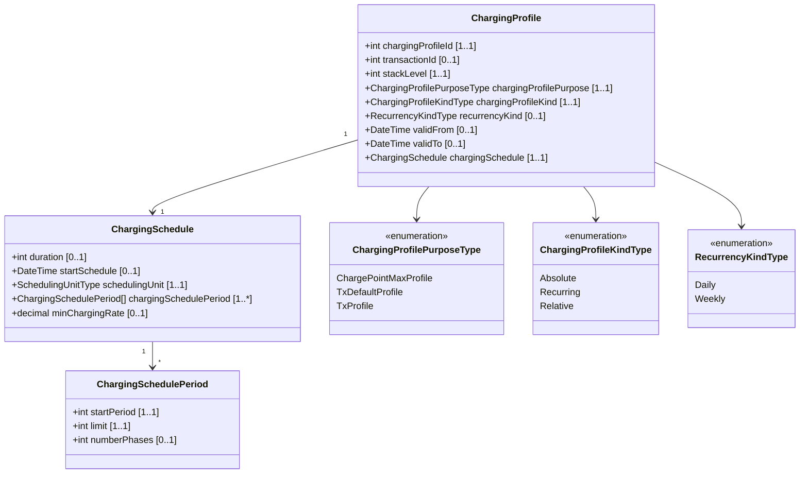

# 7. Types (타입)

> 출처: ocpp-1.6 edition 2.pdf, Chapter 7
> 작업 유형: 완전 번역 (Full Translation) - 텍스트 복붙 기반

## 7.1. AuthorizationData

**Class**

로컬 인증 목록 업데이트의 항목을 구성하는 요소.

| FIELD NAME | FIELD TYPE | CARD. | DESCRIPTION |
|------------|------------|-------|-------------|
| idTag | IdToken | 1..1 | Required. 이 인증이 적용되는 식별자. |
| idTagInfo | IdTagInfo | 0..1 | Optional. (UpdateType이 Full인 경우 필수) 인증 상태, 만료 및 parent id에 대한 정보를 포함한다. Differential 업데이트의 경우 다음이 적용된다: 이 요소가 있으면 이 항목이 로컬 인증 목록에 추가되거나 업데이트되어야 한다(SHALL). 이 요소가 없으면 이 idTag에 대한 로컬 인증 목록의 항목이 삭제되어야 한다(SHALL). |

## 7.2. AuthorizationStatus

**Enumeration**

Authorize.req에 대한 응답의 상태

| VALUE | DESCRIPTION |
|-------|-------------|
| Accepted | 식별자가 충전에 허용된다. |
| Blocked | 식별자가 차단되었다. 충전에 허용되지 않는다. |
| Expired | 식별자가 만료되었다. 충전에 허용되지 않는다. |
| Invalid | 식별자를 알 수 없다. 충전에 허용되지 않는다. |
| ConcurrentTx | 식별자가 이미 다른 트랜잭션에 관여되어 있으며 다중 트랜잭션이 허용되지 않는다. (StartTransaction.req에만 해당) |

## 7.3. AvailabilityStatus

**Enumeration**

ChangeAvailability.req에 대한 응답으로 반환되는 상태.

| VALUE | DESCRIPTION |
|-------|-------------|
| Accepted | 요청이 수락되었으며 실행될 것이다. |
| Rejected | 요청이 수락되지 않았으며 실행되지 않을 것이다. |
| Scheduled | 요청이 수락되었으며 진행 중인 트랜잭션이 완료되면 실행될 것이다. |

## 7.4. AvailabilityType

**Enumeration**

ChangeAvailability.req에서 요청된 가용성 변경.

| VALUE | DESCRIPTION |
|-------|-------------|
| Inoperative | 충전기가 충전에 사용할 수 없다. |
| Operative | 충전기가 충전에 사용 가능하다. |

## 7.5. CancelReservationStatus

**Enumeration**

CancelReservation.conf의 상태.

| VALUE | DESCRIPTION |
|-------|-------------|
| Accepted | 식별자에 대한 예약이 취소되었다. |
| Rejected | 식별자에 대해 활성 예약이 없기 때문에 예약을 취소할 수 없다. |

## 7.6. ChargePointErrorCode

**Enumeration**

StatusNotification.req에서 보고된 충전기 상태.

| VALUE | DESCRIPTION |
|-------|-------------|
| ConnectorLockFailure | 커넥터 잠금 또는 잠금 해제 실패. |
| EVCommunicationError | 차량과의 통신 실패, Mode 3 또는 기타 통신 프로토콜 문제일 수 있다. 이것은 충전기가 결함 상태로 갈 필요가 없다는 의미에서 실제 오류가 아니다. 대신 SuspendedEVSE 상태로 가야 한다. |
| GroundFailure | 지락 회로 차단기가 작동되었다. |
| HighTemperature | 충전기 내부 온도가 너무 높다. |
| InternalError | 내부 하드웨어 또는 소프트웨어 구성 요소 오류. |
| LocalListConflict | 중앙 시스템에서 받은 인증 정보가 LocalAuthorizationList와 충돌한다. |
| NoError | 보고할 오류 없음. |
| OtherError | 다른 유형의 오류. vendorErrorCode에 추가 정보. |
| OverCurrentFailure | 과전류 보호 장치가 작동했다. |
| OverVoltage | 전압이 허용 가능한 수준 이상으로 상승했다. |
| PowerMeterFailure | 전기/에너지/전력 미터 읽기 실패. |
| PowerSwitchFailure | 전원 스위치 제어 실패. |
| ReaderFailure | idTag 리더 실패. |
| ResetFailure | 재설정을 수행할 수 없다. |
| UnderVoltage | 전압이 허용 가능한 수준 이하로 떨어졌다. |
| WeakSignal | 무선 통신 장치가 약한 신호를 보고한다. |

## 7.7. ChargePointStatus

**Enumeration**

StatusNotification.req에서 보고된 상태. 상태는 충전기 메인 컨트롤러(connectorId = 0) 또는 특정 커넥터에 대해 보고될 수 있다. 충전기 메인 컨트롤러의 상태는 열거형의 하위 집합이다: Available, Unavailable 또는 Faulted.

Operative로 간주되는 상태: Available, Preparing, Charging, SuspendedEVSE, SuspendedEV, Finishing, Reserved.
Inoperative로 간주되는 상태: Unavailable, Faulted.

| STATUS | CONDITION |
|--------|-----------|
| Available | 커넥터가 새 사용자에게 사용 가능해졌을 때 (Operative) |
| Preparing | 커넥터가 더 이상 새 사용자에게 사용할 수 없지만 아직 진행 중인 트랜잭션이 없을 때. 일반적으로 커넥터는 사용자가 태그를 제시하거나 케이블을 삽입하거나 차량이 주차 공간을 차지할 때 준비 상태에 있다 (Operative) |
| Charging | 커넥터의 접촉기가 닫혀 차량이 충전할 수 있을 때 (Operative) |
| SuspendedEVSE | EV가 EVSE에 연결되어 있지만 EVSE가 스마트 충전 제한, 로컬 공급 전력 제약 또는 충전이 허용되지 않음을 나타내는 StartTransaction.conf의 결과로 EV에 에너지를 제공하지 않을 때 등 (Operative) |
| SuspendedEV | EV가 EVSE에 연결되어 있고 EVSE가 에너지를 제공하고 있지만 EV가 에너지를 받지 않을 때 (Operative) |
| Finishing | 트랜잭션이 커넥터에서 중지되었지만 커넥터가 아직 새 사용자에게 사용할 수 없을 때, 예를 들어 케이블이 제거되지 않았거나 차량이 주차 공간을 떠나지 않았을 때 (Operative) |
| Reserved | Reserve Now 명령의 결과로 커넥터가 예약되었을 때 (Operative) |
| Unavailable | Change Availability 명령의 결과 또는 충전기가 재량에 따라 사용 불가능으로 전환되는 이벤트 발생 시 커넥터가 사용 불가능해졌을 때. Change Availability 명령 수신 시 상태가 즉시 변경될 수도 있고(MAY) 예약될 수도 있다(MAY). 예약된 경우 가용성 변경이 유효해질 때 Status Notification을 전송해야 한다(shall) (Inoperative) |
| Faulted | 충전기 또는 커넥터가 오류를 보고하고 에너지 전달에 사용할 수 없을 때 (Inoperative). |

## 7.8. ChargingProfile

**Class**

ChargingProfile은 시간 간격별로 전달할 수 있는 전력 또는 전류의 양을 설명하는 ChargingSchedule로 구성된다.

| FIELD NAME | FIELD TYPE | CARD. | DESCRIPTION |
|------------|------------|-------|-------------|
| chargingProfileId | integer | 1..1 | Required. 이 프로파일에 대한 고유 식별자. |
| transactionId | integer | 0..1 | Optional. ChargingProfilePurpose가 TxProfile로 설정된 경우에만 유효하며, transactionId는 특정 트랜잭션에 프로파일을 일치시키는 데 사용될 수 있다(MAY). |
| stackLevel | integer >=0 | 1..1 | Required. 프로파일의 계층 구조 스택에서 레벨을 결정하는 값. 더 높은 값이 더 낮은 값보다 우선한다. 가장 낮은 레벨은 0이다. |
| chargingProfilePurpose | ChargingProfilePurposeType | 1..1 | Required. 이 메시지로 전송되는 스케줄의 목적을 정의한다. |
| chargingProfileKind | ChargingProfileKindType | 1..1 | Required. 스케줄의 종류를 나타낸다. |
| recurrencyKind | RecurrencyKindType | 0..1 | Optional. 반복의 시작 지점을 나타낸다. |
| validFrom | dateTime | 0..1 | Optional. 프로파일이 유효하기 시작하는 시점. 없으면 충전기가 수신하는 즉시 프로파일이 유효하다. |
| validTo | dateTime | 0..1 | Optional. 프로파일이 유효하지 않게 되는 시점. 없으면 다른 프로파일로 대체될 때까지 프로파일이 유효하다. |
| chargingSchedule | ChargingSchedule | 1..1 | Required. 시간 경과에 따라 사용 가능한 전력 또는 전류에 대한 제한을 포함한다. |

## 7.9. ChargingProfileKindType

**Enumeration**

ChargingProfile에서 사용되는 충전 프로파일의 종류.

| VALUE | DESCRIPTION |
|-------|-------------|
| Absolute | 스케줄 기간은 스케줄에 정의된 고정된 시점을 기준으로 한다. |
| Recurring | 스케줄은 첫 번째 스케줄 기간에서 주기적으로 다시 시작된다. |
| Relative | 스케줄 기간은 충전기가 결정하는 상황별 시작 지점(예: 트랜잭션 시작)을 기준으로 한다. |

## 7.10. ChargingProfilePurposeType

**Enumeration**

ChargingProfile에서 사용되는 충전 프로파일의 목적.

| VALUE | DESCRIPTION |
|-------|-------------|
| ChargePointMaxProfile | 전체 충전기에 사용 가능한 최대 전력 또는 전류에 대한 구성. |
| TxDefaultProfile | 충전기에 구성할 수 있는 기본 프로파일. 새 트랜잭션이 시작되면 충전기가 수락한 ChargingProfile이 있는 RemoteStartTransaction.req에 의해 시작된 트랜잭션이 아닌 한 이 프로파일을 사용해야 한다(SHALL). |
| TxProfile | 현재 트랜잭션에 충전기가 적용할 제약 조건이 있는 프로파일, 또는 ChargingProfile과 함께 RemoteStartTransaction.req를 통해 시작될 때 새 트랜잭션에 적용할 제약 조건이 있는 프로파일. 이 목적의 프로파일은 트랜잭션이 종료되면 유효하지 않게 된다(SHALL). |

## 7.11. ChargingProfileStatus

**Enumeration**

SetChargingProfile.req에 대한 응답으로 반환되는 상태.

| VALUE | DESCRIPTION |
|-------|-------------|
| Accepted | 요청이 수락되었으며 실행될 것이다. |
| Rejected | 요청이 수락되지 않았으며 실행되지 않을 것이다. |
| NotSupported | 충전기는 요청이 지원되지 않음을 나타낸다. |

## 7.12. ChargingRateUnitType

**Enumeration**

GetCompositeSchedule.req 및 ChargingSchedule에서 사용되는 충전 스케줄이 정의되는 단위.

| VALUE | DESCRIPTION |
|-------|-------------|
| W | Watts (전력). 이것은 허용되는 총 충전 전력이다. AC 충전에 사용되는 경우 위상 전류는 다음을 통해 계산해야 한다: 위상당 전류 = 전력 / (Line Voltage * Number of Phases). 계산에 사용되는 "Line Voltage"는 측정된 전압이 아니라 해당 지역에 설정된 전압(따라서 230 또는 110 volt)이다. "Number of Phases"는 ChargingSchedulerPeriod의 numberPhases이다. DC 충전의 경우 일반적으로 이것을 사용하는 것이 더 편리하다. ChargingSchedulePeriod에서 numberPhases가 없으면 3으로 가정해야 한다(SHALL). |
| A | Amperes (전류). 모든 위상의 합이 아닌 위상당 암페어의 양이다. AC 충전의 경우 일반적으로 이것을 사용하는 것이 더 편리하다. |

## 7.13. ChargingSchedule

**Class**

GetCompositeSchedule.conf 및 ChargingProfile에서 사용되는 충전 스케줄 구조는 충전 기간 목록을 정의한다.

| FIELD NAME | FIELD TYPE | CARD. | DESCRIPTION |
|------------|------------|-------|-------------|
| duration | integer | 0..1 | Optional. 충전 스케줄의 지속 시간(초 단위). duration이 비어 있으면 마지막 기간이 무한정 계속되거나 startSchedule이 없는 경우 트랜잭션 종료까지 계속된다. |
| startSchedule | dateTime | 0..1 | Optional. 절대 스케줄의 시작 지점. 없으면 스케줄은 충전 시작을 기준으로 한다. |
| chargingRateUnit | ChargingRateUnitType | 1..1 | Required. Limit이 표현되는 측정 단위. |
| chargingSchedulePeriod | ChargingSchedulePeriod | 1..\* | Required. 시간 경과에 따른 최대 전력 또는 전류 사용량을 정의하는 ChargingSchedulePeriod 요소 목록. 첫 번째 ChargingSchedulePeriod의 startSchedule은 항상 0이어야 한다(SHALL). |
| minChargingRate | decimal | 0..1 | Optional. 전기 차량이 지원하는 최소 충전 속도. 측정 단위는 chargingRateUnit으로 정의된다. 이 파라미터는 충전 프로세스가 더 낮은 충전 속도에서 비효율적인 경우 로컬 스마트 충전 알고리즘에서 전력 할당을 최적화하는 데 사용하도록 의도되었다. 소수점 한 자리까지 허용(예: 8.1) |

## 7.14. ChargingSchedulePeriod

**Class**

ChargingSchedule에서 사용되는 충전 스케줄 기간 구조는 충전 스케줄의 시간 기간을 정의한다.

| FIELD NAME | FIELD TYPE | CARD. | DESCRIPTION |
|------------|------------|-------|-------------|
| startPeriod | integer | 1..1 | Required. 스케줄 시작부터 초 단위로 기간의 시작. StartPeriod의 값은 이전 기간의 중지 시간도 정의한다. |
| limit | decimal | 1..1 | Required. 스케줄 기간 동안의 충전 속도 제한, 예를 들어 Amperes 또는 Watts로 표현. 해당 chargingRateUnit에서. 소수점 한 자리까지 허용(예: 8.1). |
| numberPhases | integer | 0..1 | Optional. 충전에 사용할 수 있는 위상 수. 위상 수가 필요한 경우 numberPhases=3이 주어지지 않는 한 가정된다. |

## 7.15. CiString20Type

**Type**

일반적으로 사용되는 대소문자 구분 없는 20자 문자열.

| FIELD TYPE | DESCRIPTION |
|------------|-------------|
| CiString[20] | String is case insensitive. |

## 7.16. CiString25Type

**Type**

일반적으로 사용되는 대소문자 구분 없는 25자 문자열.

| FIELD TYPE | DESCRIPTION |
|------------|-------------|
| CiString[25] | String is case insensitive. |

## 7.17. CiString50Type

**Type**

일반적으로 사용되는 대소문자 구분 없는 50자 문자열.

| FIELD TYPE | DESCRIPTION |
|------------|-------------|
| CiString[50] | String is case insensitive. |

## 7.18. CiString255Type

**Type**

일반적으로 사용되는 대소문자 구분 없는 255자 문자열.

| FIELD TYPE | DESCRIPTION |
|------------|-------------|
| CiString[255] | String is case insensitive. |

## 7.19. CiString500Type

**Type**

일반적으로 사용되는 대소문자 구분 없는 500자 문자열.

| FIELD TYPE | DESCRIPTION |
|------------|-------------|
| CiString[500] | String is case insensitive. |

## 7.20. ClearCacheStatus

**Enumeration**

ClearCache.req에 대한 응답으로 반환되는 상태.

| VALUE | DESCRIPTION |
|-------|-------------|
| Accepted | 명령이 실행되었다. |
| Rejected | 명령이 실행되지 않았다. |

## 7.21. ClearChargingProfileStatus

**Enumeration**

ClearChargingProfile.req에 대한 응답으로 반환되는 상태.

| VALUE | DESCRIPTION |
|-------|-------------|
| Accepted | 요청이 수락되었으며 실행될 것이다. |
| Unknown | 요청과 일치하는 충전 프로파일을 찾을 수 없었다. |

## 7.22. ConfigurationStatus

**Enumeration**

ChangeConfiguration.conf의 상태.

| VALUE | DESCRIPTION |
|-------|-------------|
| Accepted | 구성 키가 지원되며 설정이 변경되었다. |
| Rejected | 구성 키가 지원되지만 설정을 변경할 수 없었다. |
| RebootRequired | 구성 키가 지원되며 설정이 변경되었지만 재부팅 후에 변경 사항이 적용된다(충전기는 스스로 재부팅하지 않음). |
| NotSupported | 구성 키가 지원되지 않는다. |

## 7.23. DataTransferStatus

**Enumeration**

DataTransfer.conf의 상태.

| VALUE | DESCRIPTION |
|-------|-------------|
| Accepted | 메시지가 수락되었으며 포함된 요청이 수락되었다. |
| Rejected | 메시지가 수락되었지만 포함된 요청이 거부되었다. |
| UnknownMessageId | 메시지를 해석할 수 없었다(알 수 없는 messageId 문자열로 인해). |
| UnknownVendorId | 메시지를 해석할 수 없었다(알 수 없는 vendorId 문자열로 인해). |

## 7.24. DiagnosticsStatus

**Enumeration**

DiagnosticsStatusNotification.req의 상태.

| VALUE | DESCRIPTION |
|-------|-------------|
| Idle | 충전기는 진단 관련 작업을 수행하지 않고 있다. 상태 Idle은 TriggerMessage.req에 의해 트리거된 DiagnosticsStatusNotification.req에서만 사용되어야 한다(SHALL). |
| Uploaded | 진단 정보가 업로드되었다. |
| UploadFailed | 진단 업로드 실패. |
| Uploading | 파일이 업로드되고 있다. |

## 7.25. FirmwareStatus

**Enumeration**

FirmwareStatusNotification.req에서 보고된 펌웨어 다운로드 상태.

| VALUE | DESCRIPTION |
|-------|-------------|
| Downloaded | 충전기가 새 펌웨어를 다운로드했다. |
| DownloadFailed | 충전기가 펌웨어 다운로드에 실패했다. |
| Downloading | 펌웨어가 다운로드되고 있다. |
| Idle | 충전기는 펌웨어 업데이트 관련 작업을 수행하지 않고 있다. 상태 Idle은 TriggerMessage.req에 의해 트리거된 FirmwareStatusNotification.req에서만 사용되어야 한다(SHALL). |
| InstallationFailed | 새 펌웨어 설치가 실패했다. |
| Installing | 펌웨어가 설치되고 있다. |
| Installed | 충전기에 새 펌웨어가 성공적으로 설치되었다. |

## 7.26. GetCompositeScheduleStatus

**Enumeration**

GetCompositeSchedule.req에 대한 응답으로 반환되는 상태.

| VALUE | DESCRIPTION |
|-------|-------------|
| Accepted | 요청이 수락되었으며 실행될 것이다. |
| Rejected | 요청이 수락되지 않았으며 실행되지 않을 것이다. |

## 7.27. IdTagInfo

**Class**

식별자에 대한 상태 정보를 포함한다. Authorize, Start Transaction 및 Stop Transaction 응답에서 반환된다.
expiryDate가 제공되지 않으면 상태에 종료 날짜가 없다.

| FIELD NAME | FIELD TYPE | CARD. | DESCRIPTION |
|------------|------------|-------|-------------|
| expiryDate | dateTime | 0..1 | Optional. idTag가 인증 캐시에서 제거되어야 하는 날짜를 포함한다. |
| parentIdTag | IdToken | 0..1 | Optional. 상위 식별자를 포함한다. |
| status | AuthorizationStatus | 1..1 | Required. idTag가 중앙 시스템에 의해 수락되었는지 여부를 포함한다. |

## 7.28. IdToken

**Type**

인증에 사용할 식별자를 포함한다. 대소문자를 구분하지 않는 문자열이다. 향후 릴리스에서는 여러 형태의 식별자를 지원하기 위해 복합 타입이 될 수 있다.

| FIELD TYPE | DESCRIPTION |
|------------|-------------|
| CiString20Type | IdToken is case insensitive. |

## 7.29. KeyValue

**Class**

특정 구성 키에 대한 정보를 포함한다. GetConfiguration.conf에서 반환된다.

| NAME | FIELD TYPE | CARD. | DESCRIPTION |
|------|------------|-------|-------------|
| key | CiString50Type | 1..1 | Required. |
| readonly | boolean | 1..1 | Required. ChangeConfiguration 메시지로 값을 설정할 수 있으면 False. |
| value | CiString500Type | 0..1 | Optional. 키를 알고 있지만 설정되지 않은 경우 이 필드가 없을 수 있다. |

## 7.30. Location

**Enumeration**

SampledValue의 Value 요소에서 선택적 "location" 필드의 허용 가능한 값.

| VALUE | DESCRIPTION |
|-------|-------------|
| Body | 충전기 본체 내부의 측정(예: 온도) |
| Cable | EV와 충전기 사이의 케이블에서 측정 |
| EV | EV에서 측정 |
| Inlet | 네트워크("grid") 인입 연결에서 측정 |
| Outlet | 커넥터에서 측정. 기본값 |

## 7.31. Measurand

**Enumeration**

MeterValues.req 및 StopTransaction.req 메시지에서 사용되는 Value 요소의 선택적 "measurand" 필드의 허용 가능한 값.
"measurand"의 기본값은 항상 "Energy.Active.Import.Register"이다.

> **참고:** Import는 Grid에서 충전기, EV 또는 기타 부하로의 에너지 흐름이다. Export는 EV에서 충전기로 및/또는 충전기에서 Grid로의 에너지 흐름이다.

| VALUE | DESCRIPTION |
|-------|-------------|
| Current.Export | EV에서의 순간 전류 흐름 |
| Current.Import | EV로의 순간 전류 흐름 |
| Current.Offered | EV에 제공되는 최대 전류 |
| Energy.Active.Export.Register | (가장 권위 있는) 전기 미터의 "active electrical energy"(Wh 또는 kWh) 레지스터에서 읽은 수치 값으로 (그리드로) 내보낸 에너지를 측정한다. |
| Energy.Active.Import.Register | (가장 권위 있는) 전기 미터의 "active electrical energy"(Wh 또는 kWh) 레지스터에서 읽은 수치 값으로 (그리드 공급으로부터) 가져온 에너지를 측정한다. |
| Energy.Reactive.Export.Register | (가장 권위 있는) 전기 미터의 "reactive electrical energy"(VARh 또는 kVARh) 레지스터에서 읽은 수치 값으로 (그리드로) 내보낸 에너지를 측정한다. |
| Energy.Reactive.Import.Register | (가장 권위 있는) 전기 미터의 "reactive electrical energy"(VARh 또는 kVARh) 레지스터에서 읽은 수치 값으로 (그리드 공급으로부터) 가져온 에너지를 측정한다. |
| Energy.Active.Export.Interval | MetervaluesReadingContext에 의해 지정되고 "ClockAlignedDataInterval" 및 "MeterValueSampleInterval"에 대한 적용 가능한 interval duration 구성 값(초)에 따라 연관된 시간 "interval" 동안 (그리드로) 내보낸 "active electrical energy"(Wh 또는 kWh)의 절대량. |
| Energy.Active.Import.Interval | MetervaluesReadingContext에 의해 지정되고 "ClockAlignedDataInterval" 및 "MeterValueSampleInterval"에 대한 적용 가능한 interval duration 구성 값(초)에 따라 연관된 시간 "interval" 동안 (그리드 공급으로부터) 가져온 "active electrical energy"(Wh 또는 kWh)의 절대량. |
| Energy.Reactive.Export.Interval | MetervaluesReadingContext에 의해 지정되고 "ClockAlignedDataInterval" 및 "MeterValueSampleInterval"에 대한 적용 가능한 interval duration 구성 값(초)에 따라 연관된 시간 "interval" 동안 (그리드로) 내보낸 "reactive electrical energy"(VARh 또는 kVARh)의 절대량. |
| Energy.Reactive.Import.Interval | MetervaluesReadingContext에 의해 지정되고 "ClockAlignedDataInterval" 및 "MeterValueSampleInterval"에 대한 적용 가능한 interval duration 구성 값(초)에 따라 연관된 시간 "interval" 동안 (그리드 공급으로부터) 가져온 "reactive electrical energy"(VARh 또는 kVARh)의 절대량. |
| Frequency | 전력선 주파수의 순간 판독. 참고: OCPP 1.6은 주파수에 대한 UnitOfMeasure가 없으며, measurand가 있는 모든 SampledValue의 UnitOfMeasure는 Hertz이다. 주파수는 Hertz이다. |
| Power.Active.Export | EV에 의해 내보내진 순간 활성 전력. (W 또는 kW) |
| Power.Active.Import | EV에 의해 가져온 순간 활성 전력. (W 또는 kW) |
| Power.Factor | 총 에너지 흐름의 순간 역률 |
| Power.Offered | EV에 제공되는 최대 전력 |
| Power.Reactive.Export | EV에 의해 내보내진 순간 무효 전력. (var 또는 kvar) |
| Power.Reactive.Import | EV에 의해 가져온 순간 무효 전력. (var 또는 kvar) |
| RPM | RPM 단위의 팬 속도 |
| SoC | 충전 차량의 충전 상태(백분율) |
| Temperature | 충전기 내부의 온도 판독. |
| Voltage | 순간 AC RMS 공급 전압 |

> **참고:** 단일 충전 트랜잭션 또는 비트랜잭션 소비자(예: 충전기 내부 전원 공급 장치, 전체 공급)와 관련된 모든 "Register" 값은 시간에 따라 단조 증가해야 한다(MUST).
>
> 보고된 ".Register" 값에 해당하는 실제 에너지 양은 해당 레지스터 값에서 트랜잭션 시작 시 또는 기타 관련 시작 참조 시점에 기록/보고된 레지스터 값을 뺀 값으로 계산된다. 감사 가능성 향상을 위해 ".Register" 값은 전기 계량 하드웨어의 비휘발성 레지스터에서 직접 읽은 그대로 정확히 보고되어야 하며(SHOULD), 트랜잭션 시작 시 0으로 재설정되어서는 안 된다(SHOULD NOT). 이를 통해 중앙 시스템이 트랜잭션의 시작 레지스터 값이 동일한 커넥터의 이전 트랜잭션 종료 레지스터 값과 동일한지 확인할 수 있어 하드웨어 결함, 배선 오류, 사기 등으로 인한 순차 트랜잭션 간의 "누락 에너지"를 식별할 수 있다.

## 7.32. MessageTrigger

**Enumeration**

TriggerMessage.req에서 트리거할 요청 유형.

| VALUE | DESCRIPTION |
|-------|-------------|
| BootNotification | BootNotification 요청을 트리거한다 |
| DiagnosticsStatusNotification | DiagnosticsStatusNotification 요청을 트리거한다 |
| FirmwareStatusNotification | FirmwareStatusNotification 요청을 트리거한다 |
| Heartbeat | Heartbeat 요청을 트리거한다 |
| MeterValues | MeterValues 요청을 트리거한다 |
| StatusNotification | StatusNotification 요청을 트리거한다 |

## 7.33. MeterValue

**Class**

MeterValues.req 및 StopTransaction.req에서 하나 이상의 샘플링된 값의 모음. MeterValue의 모든 샘플링된 값은 동일한 시점에 샘플링된다.

| FIELD NAME | FIELD TYPE | CARD. | DESCRIPTION |
|------------|------------|-------|-------------|
| timestamp | dateTime | 1..1 | Required. 측정된 값의 타임스탬프. |
| sampledValue | SampledValue | 1..\* | Required. 하나 이상의 측정된 값 |

## 7.34. Phase

**Enumeration**

SampledValue에서 사용되는 위상. Phase는 측정값을 해석하는 방법을 지정한다. Phase의 모든 값이 모든 Measurand에 적용되는 것은 아니다.

| VALUE | DESCRIPTION |
|-------|-------------|
| L1 | L1에서 측정 |
| L2 | L2에서 측정 |
| L3 | L3에서 측정 |
| N | Neutral에서 측정 |
| L1-N | Neutral 도체에 대한 L1에서 측정 |
| L2-N | Neutral 도체에 대한 L2에서 측정 |
| L3-N | Neutral 도체에 대한 L3에서 측정 |
| L1-L2 | L1과 L2 사이에서 측정 |
| L2-L3 | L2와 L3 사이에서 측정 |
| L3-L1 | L3과 L1 사이에서 측정 |

## 7.35. ReadingContext

**Enumeration**

SampledValue의 값에서 context 필드의 값.

| VALUE | DESCRIPTION |
|-------|-------------|
| Interruption.Begin | 중단 시작 시 취한 값. |
| Interruption.End | 중단 후 재개 시 취한 값. |
| Other | 기타 모든 상황에 대한 값. |
| Sample.Clock | 클럭 정렬 간격에서 취한 값. |
| Sample.Periodic | 트랜잭션 시작 시간에 상대적인 주기적 샘플로 취한 값. |
| Transaction.Begin | 트랜잭션 시작 시 취한 값. |
| Transaction.End | 트랜잭션 종료 시 취한 값. |
| Trigger | TriggerMessage.req에 대한 응답으로 취한 값 |

## 7.36. Reason

**Enumeration**

StopTransaction.req에서 트랜잭션을 중지하는 이유.

| VALUE | DESCRIPTION |
|-------|-------------|
| DeAuthorized | StartTransaction.conf의 인증 상태로 인해 트랜잭션이 중지되었다 |
| EmergencyStop | 비상 정지 버튼이 사용되었다. |
| EVDisconnected | 케이블 분리, 차량이 유도 충전 장치에서 이동. |
| HardReset | 하드 리셋 명령이 수신되었다. |
| Local | 충전기에서 사용자 요청에 의해 로컬로 중지되었다. 이것은 트랜잭션의 정기적인 종료이다. 예: RFID 태그 제시, 정지 버튼 누름. |
| Other | 기타 이유. |
| PowerLoss | 완전한 전력 손실. |
| Reboot | 로컬에서 시작된 리셋/재부팅이 발생했다. (예를 들어 워치독이 작동함) |
| Remote | 사용자 요청에 의해 원격으로 중지되었다. 이것은 트랜잭션의 정기적인 종료이다. 예: 스마트폰 앱을 사용한 종료, (로컬이 아닌) 선불 크레딧 초과. |
| SoftReset | 소프트 리셋 명령이 수신되었다. |
| UnlockCommand | 중앙 시스템이 Unlock Connector 명령을 전송했다. |

## 7.37. RecurrencyKindType

**Enumeration**

ChargingProfile에서 사용되는 충전 프로파일의 반복 유형.

| VALUE | DESCRIPTION |
|-------|-------------|
| Daily | 스케줄은 startSchedule과 동일한 시간에 24시간마다 재시작된다. |
| Weekly | 스케줄은 startSchedule과 동일한 시간 및 요일에 7일마다 재시작된다. |

## 7.38. RegistrationStatus

**Enumeration**

BootNotification.req에 대한 응답으로 등록 결과.

| VALUE | DESCRIPTION |
|-------|-------------|
| Accepted | 충전기가 중앙 시스템에 의해 수락되었다. |
| Pending | 중앙 시스템이 아직 충전기를 수락할 준비가 되지 않았다. 중앙 시스템은 정보를 검색하거나 충전기를 준비하기 위해 메시지를 보낼 수 있다. |
| Rejected | 충전기가 중앙 시스템에 의해 수락되지 않았다. 이것은 충전기 ID가 중앙 시스템에 알려지지 않았을 때 발생할 수 있다. |

## 7.39. RemoteStartStopStatus

**Enumeration**

RemoteStartTransaction.req 또는 RemoteStopTransaction.req 요청의 결과.

| VALUE | DESCRIPTION |
|-------|-------------|
| Accepted | 명령이 실행될 것이다. |
| Rejected | 명령이 실행되지 않을 것이다. |

## 7.40. ReservationStatus

**Enumeration**

ReserveNow.conf의 상태.

| VALUE | DESCRIPTION |
|-------|-------------|
| Accepted | 예약이 이루어졌다. |
| Faulted | 커넥터들 또는 지정된 커넥터가 결함 상태에 있어 예약이 이루어지지 않았다. |
| Occupied | 모든 커넥터 또는 지정된 커넥터가 사용 중이어서 예약이 이루어지지 않았다. |
| Rejected | 충전기가 예약을 수락하도록 구성되지 않아 예약이 이루어지지 않았다. |
| Unavailable | 커넥터들 또는 지정된 커넥터가 사용 불가능 상태에 있어 예약이 이루어지지 않았다. |

## 7.41. ResetStatus

**Enumeration**

Reset.req의 결과.

| VALUE | DESCRIPTION |
|-------|-------------|
| Accepted | 명령이 실행될 것이다. |
| Rejected | 명령이 실행되지 않을 것이다. |

## 7.42. ResetType

**Enumeration**

Reset.req에 의해 요청된 리셋 유형.

| VALUE | DESCRIPTION |
|-------|-------------|
| Hard | (모든) 하드웨어를 재시작하며, 충전기는 진행 중인 트랜잭션을 정상적으로 중지할 필요가 없다. 가능하면 충전기는 재시작하고 BootNotification.conf를 통해 중앙 시스템에 의해 수락된 후 이전에 진행 중이던 트랜잭션에 대해 StopTransaction.req를 전송한다. 이것은 올바르게 작동하지 않는 충전기에 대한 마지막 수단 솔루션이며, "hard" 리셋 시 (큐에 대기된) 정보가 손실될 수 있다. |
| Soft | 진행 중인 트랜잭션을 정상적으로 중지하고 모든 트랜잭션에 대해 StopTransaction.req를 전송한다. 그런 다음 애플리케이션 소프트웨어를 재시작해야 한다(가능한 경우, 그렇지 않으면 프로세서/컨트롤러를 재시작). |

## 7.43. SampledValue

**Class**

MeterValues의 단일 샘플링된 값. 각 값은 선택적 필드를 동반할 수 있다.

| FIELD NAME | FIELD TYPE | CARD. | DESCRIPTION |
|------------|------------|-------|-------------|
| value | String | 1..1 | Required. "Raw"(decimal) 숫자 또는 "SignedData"로서의 값. Field Type은 디지털 서명된 데이터 판독을 허용하기 위해 "string"이다. 10진수 숫자 값도 Temperature 및 Current와 같은 measurand의 분수 값을 허용하기 위해 허용된다. |
| context | ReadingContext | 0..1 | Optional. 세부 값의 유형: start, end 또는 sample. Default = "Sample.Periodic" |
| format | ValueFormat | 0..1 | Optional. Raw 또는 signed data. Default = "Raw" |
| measurand | Measurand | 0..1 | Optional. 측정 유형. Default = "Energy.Active.Import.Register" |
| phase | Phase | 0..1 | Optional. 측정값을 해석하는 방법을 나타낸다. 예를 들어 L1과 neutral(L1-N) 사이. 모든 phase 값이 모든 Measurand에 적용되는 것은 아니다. phase가 없으면 측정값은 전체 값으로 해석된다. |
| location | Location | 0..1 | Optional. 측정 위치. Default="Outlet" |
| unit | UnitOfMeasure | 0..1 | Optional. 값의 단위. (기본) measurand가 "Energy" 유형이면 Default = "Wh". |

## 7.44. TriggerMessageStatus

**Enumeration**

TriggerMessage.conf의 상태.

| VALUE | DESCRIPTION |
|-------|-------------|
| Accepted | 요청된 알림이 전송될 것이다. |
| Rejected | 요청된 알림이 전송되지 않을 것이다. |
| NotImplemented | 요청된 알림이 구현되지 않았거나 알 수 없어 전송될 수 없다. |

## 7.45. UnitOfMeasure

**Enumeration**

SampledValue에서 사용되는 Value 요소의 선택적 "unit" 필드의 허용 가능한 값.
"unit"의 기본값은 항상 "Wh"이다.

| VALUE | DESCRIPTION |
|-------|-------------|
| Wh | Watt-hours (에너지). Default. |
| kWh | kiloWatt-hours (에너지). |
| varh | Var-hours (무효 에너지). |
| kvarh | kilovar-hours (무효 에너지). |
| W | Watts (전력). |
| kW | kilowatts (전력). |
| VA | VoltAmpere (피상 전력). |
| kVA | kiloVolt Ampere (피상 전력). |
| var | Vars (무효 전력). |
| kvar | kilovars (무효 전력). |
| A | Amperes (전류). |
| V | Voltage (r.m.s. AC). |
| Celsius | Degrees (온도). |
| Fahrenheit | Degrees (온도). |
| K | Degrees Kelvin (온도). |
| Percent | Percentage. |

## 7.46. UnlockStatus

**Enumeration**

UnlockConnector.req에 대한 응답 상태.

| VALUE | DESCRIPTION |
|-------|-------------|
| Unlocked | 커넥터가 성공적으로 잠금 해제되었다. |
| UnlockFailed | 커넥터 잠금 해제 실패: 충전기가 커넥터 잠금을 해제하려고 시도했으나 커넥터가 여전히 잠겨 있거나 잠금 해제 메커니즘이 실패했음을 감지했다. |
| NotSupported | 충전기에 커넥터 잠금 장치가 없거나 ConnectorId가 알려지지 않았다. |

## 7.47. UpdateStatus

**Enumeration**

SendLocalList.req에 대한 업데이트 상태.

| VALUE | DESCRIPTION |
|-------|-------------|
| Accepted | Local Authorization List가 성공적으로 업데이트되었다. |
| Failed | Local Authorization List 업데이트 실패. |
| NotSupported | 충전기에서 Local Authorization List 업데이트가 지원되지 않는다. |
| VersionMismatch | 차등 업데이트 요청의 버전 번호가 현재 목록의 버전 번호보다 작거나 같다. |

## 7.48. UpdateType

**Enumeration**

SendLocalList.req의 업데이트 유형.

| VALUE | DESCRIPTION |
|-------|-------------|
| Differential | 현재 Local Authorization List를 이 메시지의 값으로 업데이트해야 함을 나타낸다. |
| Full | 현재 Local Authorization List를 이 메시지의 값으로 대체해야 함을 나타낸다. |

## 7.49. ValueFormat

**Enumeration**

SampledValue의 value 요소를 해석하는 방법을 지정하는 형식.

| VALUE | DESCRIPTION |
|-------|-------------|
| Raw | 데이터는 integer/decimal 숫자 데이터로 해석되어야 한다. |
| SignedData | 데이터는 hex 데이터로 인코딩된 서명된 이진 데이터 블록으로 표현된다. |
